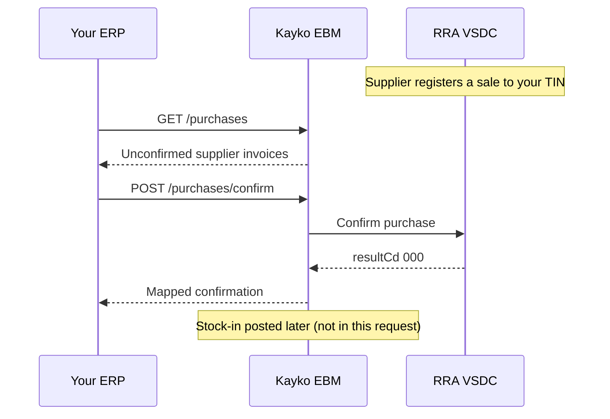

When another EBM taxpayer sells to your TIN, RRA already holds that sale. Your CIS must **discover** those invoices and **confirm** them as purchases. Confirmation is how you claim input-side processing and how Kayko knows to enqueue stock-in.

Send `x-tin` and `x-branch-id` on every route below. Requires API key scope `purchase`. You never put `ebm_url` in the body.

Cross-flow in words: poll purchases → ensure each line’s `item_code` is registered via [`POST /items`](/api/items) → confirm at head office → wait for asynchronous stock-in (seed [`POST /stocks/master`](/api/stock) first). Full checklist: [Integration Checklist](/workflows/getting-started).



<Warning>
  Confirm must use head office `x-branch-id: 00`. Other branches receive `403` / `EBM_HEAD_OFFICE_REQUIRED`. List works for any allowed branch.
</Warning>

---

## List purchases

`GET /purchases`

Send `x-last-request-date` (`YYYYMMDDHHmmss`). First sync: `20000101000000`.

<CodeGroup>

```bash cURL
curl -X GET "{{baseUrl}}/purchases" \
  -H "Authorization: Bearer sk_live_YOUR_SECRET" \
  -H "x-tin: 100027060" \
  -H "x-branch-id: 00" \
  -H "x-last-request-date: 20000101000000"
```

```javascript JavaScript
const data = await fetch(`${BASE_URL}/purchases`, {
  headers: {
    Authorization: `Bearer ${process.env.KAYKO_EBM_API_KEY}`,
    'x-tin': '100027060',
    'x-branch-id': '00',
    'x-last-request-date': '20000101000000',
  },
}).then((r) => r.json());
```

</CodeGroup>

Response: `{ message, data: Purchase[] }`. Empty lists return `{ "message": "No purchases found", "data": [] }`.

Each purchase includes supplier identity, payment/receipt labels, tax buckets A–D as returned by VSDC, and `items[]` with your mapped line fields (`item_code`, `quantity`, `tax_type`, `supplier_item_code`, …).

Map supplier lines to **your** registered `item_code` before confirm. Confirm rejects unknown items.

---

## Confirm purchase

`POST /purchases/confirm`

Kayko maps snake_case labels to VSDC codes. For a normal purchase, Kayko sends upstream `orgInvcNo: 0`. For a refund, send `receipt_type: refund` and `original_invoice_no` of the purchase you are reversing.

<ParamField body="invoice_no" type="integer" required>Your sequential purchase invoice number</ParamField>
<ParamField body="original_invoice_no" type="integer">Required when `receipt_type` is `refund`</ParamField>
<ParamField body="registration_type" type="string" required>`automatic` or `manual`</ParamField>
<ParamField body="payment_method" type="string" required>Label: `cash`, `credit`, `cash_credit`, `bank_check`, `card`, `mobile_money`, `other`</ParamField>
<ParamField body="transaction_type" type="string">`normal` (default), `copy`, `proforma`, `training`</ParamField>
<ParamField body="receipt_type" type="string">`purchase` (default) or `refund`</ParamField>
<ParamField body="status" type="string">Usually `approved`</ParamField>
<ParamField body="supplier" type="object">Supplier identity. For `automatic`, `tin_no` and `invoice_no` are required.</ParamField>
<ParamField body="supplier.tin_no" type="string">9-digit supplier TIN</ParamField>
<ParamField body="supplier.branch_id" type="string">Supplier branch (2 chars)</ParamField>
<ParamField body="supplier.full_name" type="string">Supplier name</ParamField>
<ParamField body="supplier.invoice_no" type="integer">Supplier invoice number</ParamField>
<ParamField body="supplier.sdc_id" type="string">Supplier SDC ID</ParamField>
<ParamField body="dates" type="object">Optional purchase timestamps</ParamField>
<ParamField body="dates.purchase_date" type="string">`YYYYMMDD`; defaults to today</ParamField>
<ParamField body="dates.confirmed_at" type="string">`YYYYMMDDHHmmss`</ParamField>
<ParamField body="dates.warehoused_at" type="string">`YYYYMMDDHHmmss`</ParamField>
<ParamField body="items" type="array" required>Line items (see below)</ParamField>

Optional header totals (`taxable_amount_a`–`tt`, `tax_amount_*`, `total_*`), omit them to let Kayko compute from lines. If you send them, they must match. Kayko always forwards live VSDC tax rates including **E** (0), **F** (tourism 3%), and **TT** (3%).

`sequence` is optional. Omit it to auto-number lines `1…n` in array order. If you send it, values must be consecutive starting at `1` matching that order.

### Line items

| Field | Required | Notes |
|-------|----------|-------|
| `item_code` | Y | Must already be registered |
| `item_classification_code` | Y | 10 digits |
| `item_name` | Y | |
| `packaging_unit` | Y | |
| `packages` | Y | |
| `quantity_unit` | Y | |
| `quantity` | Y | Positive |
| `price` | Y | Tax-inclusive unit price |
| `tax_type` | Y | `A`–`D`, `E`, `F`, `TT` |
| `supply_amount`, `discount_*`, `taxable_amount`, `tax_amount`, `total_amount` | N | Computed if omitted |
| `supplier_item_code` / `supplier_item_name` / `supplier_item_classification_code` | N | Supplier cross-reference |
| `expiry_date` | N | `YYYYMMDD` |

<CodeGroup>

```bash cURL
curl -X POST "{{baseUrl}}/purchases/confirm" \
  -H "Content-Type: application/json" \
  -H "Authorization: Bearer sk_live_YOUR_SECRET" \
  -H "x-tin: 100027060" \
  -H "x-branch-id: 00" \
  -d '{
    "invoice_no": 501,
    "registration_type": "automatic",
    "payment_method": "credit",
    "supplier": {
      "tin_no": "100004527",
      "full_name": "RULIBA CLAYS LTD",
      "invoice_no": 1799
    },
    "dates": {
      "purchase_date": "20260303"
    },
    "items": [{
      "item_code": "RW2NTU0000001",
      "item_classification_code": "8014160101",
      "item_name": "Coca Cola",
      "packaging_unit": "NT",
      "packages": 1,
      "quantity_unit": "U",
      "quantity": 10,
      "price": 118,
      "tax_type": "B"
    }]
  }'
```

```javascript JavaScript
await fetch(`${BASE_URL}/purchases/confirm`, {
  method: 'POST',
  headers: {
    'Content-Type': 'application/json',
    Authorization: `Bearer ${process.env.KAYKO_EBM_API_KEY}`,
    'x-tin': '100027060',
    'x-branch-id': '00',
  },
  body: JSON.stringify({
    invoice_no: 501,
    registration_type: 'automatic',
    payment_method: 'credit',
    supplier: {
      tin_no: '100004527',
      full_name: 'RULIBA CLAYS LTD',
      invoice_no: 1799,
    },
    dates: {
      purchase_date: '20260303',
    },
    items: [
      {
        item_code: 'RW2NTU0000001',
        item_classification_code: '8014160101',
        item_name: 'Coca Cola',
        packaging_unit: 'NT',
        packages: 1,
        quantity_unit: 'U',
        quantity: 10,
        price: 118,
        tax_type: 'B',
      },
    ],
  }),
});
```

```json Payload
{
  "invoice_no": 501,
  "registration_type": "automatic",
  "payment_method": "credit",
  "supplier": {
    "tin_no": "100004527",
    "full_name": "RULIBA CLAYS LTD",
    "invoice_no": 1799
  },
  "dates": {
    "purchase_date": "20260303"
  },
  "items": [
    {
      "item_code": "RW2NTU0000001",
      "item_classification_code": "8014160101",
      "item_name": "Coca Cola",
      "packaging_unit": "NT",
      "packages": 1,
      "quantity_unit": "U",
      "quantity": 10,
      "price": 118,
      "tax_type": "B"
    }
  ]
}
```

</CodeGroup>

Response `{ message, data }` includes `invoice_no`, `original_invoice_no` (`0` for a normal purchase), supplier fields, and mapped labels (`registration_type`, `receipt_type`, `payment_method`, `status`).

After VSDC `000`, Kayko enqueues stock-in (`purchase`). Purchase refunds enqueue stock-out (`return` / type `12`). Services (`item_type` `service`) are skipped. Seed `POST /stocks/master` first so remaining quantity can update. Do not nest stock in this HTTP request.
