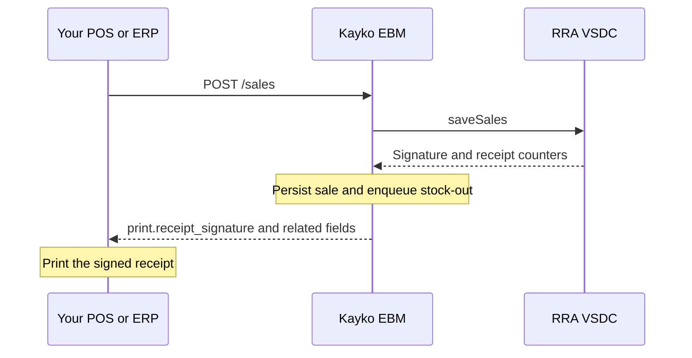

A **sale** in EBM is the fiscal record of goods or services you sold: customer identity (optional), payment method, line items with tax types, and dates. Kayko sends that record to your Virtual Sales Data Controller (VSDC), which signs it with RRA and returns the values you must print on the customer receipt.

**Authentication:** business API key with scope `sales`.  
**Headers on every route:** `x-tin` (nine-character TIN) and `x-branch-id` (two-character branch). Any allowed branch may sell; you do not put `ebm_url` in the body.

### Prerequisites

Register every `item_code` with [`POST /items`](/api/items) before selling it. Unknown codes return `EBM_ITEM_NOT_REGISTERED`. For stocked goods, seed on-hand quantity with [`POST /stocks/master`](/api/stock) so the automatic stock-out after a successful sale can update the ledger. Services (`item_type` `service`) skip stock.

Kayko does **not** post stock in the same HTTP response as the sale. After VSDC returns success (`000`), a stock-out job is queued asynchronously.

---

## Create new sale

`POST /sales`

Use this for a **normal** fiscal sale. Kayko always sends upstream transaction type normal and receipt type sale, and sets **`orgInvcNo` to `0`**. Do **not** set `original_invoice_no` equal to `invoice_no` on this route, that produces VSDC `910`. Refunds belong on `POST /sales/refund`.

### Request fields

| Field | Required | Format and meaning |
|-------|----------|--------------------|
| `invoice_no` | Yes | Positive integer. Your sequential CIS invoice number. Must be unique for new sales. |
| `payment_method` | Yes | Label: `cash`, `credit`, `cash_credit`, `bank_check`, `card`, `mobile_money`, or `other`. See [Enumerations](/reference/enumerations#payment-method). |
| `items` | Yes | Array of one or more lines (see below). |
| `customer` | No | Nested object. Prefer this over any legacy flat examples. |
| `customer.tin_no` | No | Nine-character customer TIN. Required for business buyers; validate with [`GET /customers`](/api/customers) when unsure. |
| `customer.full_name` | No | Customer display name (max 60 upstream). |
| `customer.telephone` | No | Phone; Kayko normalizes digits for VSDC. |
| `purchase_code` | Conditional | Max **6** characters. **Required when the customer is a business (TIN present).** Missing → VSDC **`881`**. |
| `status` | No | Label such as `approved`, `canceled`, `refunded`, `transferred`. Defaults appropriately when omitted. |
| `dates` | No | Nested dates object. |
| `dates.origin_date` | No | Sale date `YYYYMMDD`. Defaults to today when omitted. |
| `dates.confirmed_at` | No | Confirmation timestamp `YYYYMMDDHHmmss`. |
| `dates.stock_released_at` | No | Optional stock-release timestamp, or null. |
| `buyer_accepted` | No | Boolean; treated as accepted when omitted. |
| `sale_purpose` | Conditional | `FOR_RESELL` or `FOR_CONSUMPTION`. **Required when any line is fuel** (`tax_type` `F` or a fuel classification). Omitted on ordinary sales. |
| `notes` | No | Free text (max 400). |
| `receipt` | No | Optional print template fields (`report_number`, `customer_tin`, `customer_mobile`, `trade_name`, `address`, `header`, `footer`). |

Optional header amount buckets (`taxable_amount_a` … `tt`, `tax_amount_*`, `total_*`) may be omitted so Kayko computes them from lines. If you send them, they must match line math or VSDC returns **`910`**.

**Tax type `F` is VAT on fuel (18%), not tourism.** Tourism is a flag on the item/line (`use_tourism_tax`), not a VAT category. Do **not** send `tax_type: "TT"`. Details: [Tourism Tax and VAT on Fuel](/calculations/tourism-and-fuel).

### Line items

| Field | Required | Notes |
|-------|----------|-------|
| `sequence` | Yes | Integer 1–999; unique per invoice, typically consecutive. |
| `item_code` | Yes | Must already be registered. |
| `item_name` | Yes | Max 200. |
| `packaging_unit` | Yes | Code from packaging constants (for example `NT`). |
| `packages` | Yes | Number ≥ 0, max two decimals. |
| `quantity_unit` | Yes | Code from quantity constants (for example `U`). |
| `quantity` | Yes | Positive quantity. |
| `price` | Yes | Tax-inclusive unit price. |
| `tax_type` | Yes | Usually `B` (18% VAT). Use `F` only for RRA fuel products. Never `TT`. See [VAT Formulas](/calculations/vat-formulas) and [Tourism Tax and VAT on Fuel](/calculations/tourism-and-fuel). |
| `item_classification_code` | No | Ten digits; filled from catalog when omitted. |
| `barcode` | No | Optional. |
| `use_tourism_tax` | No | When `true`, this line is tourism-taxable. Prefer registering the item with `use_tourism_tax` so the catalog carries `useTTaxYn: Y`. |
| `rrp` | Conditional | Regulated retailer price. Required on fuel lines (or taken from catalog `default_price`). |
| `regulated_discount` | No | Fuel only, 0–120 (`prftDcAmt`). Normal `discount_*` fields are rejected on fuel. |
| `supply_amount`, `discount_rate`, `discount_amount`, `total_discount_amount`, `taxable_amount`, `tax_amount`, `total_amount` | No | Computed when omitted. |
| `insurance_code`, `insurance_name`, `insurance_rate`, `insurance_amount` | No | Pharmacy / insured sales lines. |

Category B and fuel `F` VAT extraction uses taxable amount × 18 / 118, rounded to two decimals. Tourism tax uses × 3 / 103 on the VAT-exclusive amount.

### Success response

The response is `{ message, data, ebm }`. `data` includes `invoice_no`, `original_invoice_no`, `receipt_type`, `status`, `replayed`, and a `print` object with `receipt_no`, `total_receipt_no`, `internal_data`, `receipt_signature`, `receipt_published_at`, `sdc_id`, `mrc_no`, and `tourism`. `ebm` is the unmodified VSDC envelope (`resultCd`, `resultMsg`, `resultDt`, `data`) from `saveSales` / `resendSales`. It is `null` on `GET /sales/:invoice_no` and on replayed local copies (no live device call).

Print **`print.receipt_signature`** and **`print.internal_data`** (and the counters / SDC / MRC as required by your receipt layout). For tourism-registered TINs, also print `print.tourism.disclaimer` when it is set. Definitions: [Glossary](/reference/glossary).

### Persist failure after signing

If VSDC returns success but Kayko cannot store the sale locally, you receive **HTTP 503** with `error: EBM_SALE_PERSIST_FAILED` and the signature fields in the body. The invoice **is already signed**. Do not allocate a new `invoice_no`. Retry with [`POST /sales/resend`](#resend-sale).

If the local sales store is unavailable before the VSDC call, Kayko returns `EBM_SALES_STORE_UNAVAILABLE` and does not fiscalize.

### Common VSDC-mapped errors

| `status` | Meaning | What to do |
|----------|---------|------------|
| `881` | Purchase code mandatory | Send `purchase_code` for business customers |
| `884` | Invalid customer TIN | Look up TIN with `GET /customers` |
| `910` | Parameter validation (totals, `orgInvcNo`, tax rates, types) | Fix payload. Live devices require `taxRtF` (18) and `taxRtTt` (3). See [Tourism Tax and VAT on Fuel](/calculations/tourism-and-fuel). |
| `994` | Duplicate / overlapped | Treat carefully; Kayko may treat some duplicates as already accepted on retry paths |

Full table: [Response Codes](/reference/response-codes).

---

## Refund sale

`POST /sales/refund`

Issues a fiscal **refund** receipt linked to a prior sale. Kayko sends receipt type refund and sets `orgInvcNo` to the original invoice. Stock-in for the refund is queued after success.

| Field | Required | Notes |
|-------|----------|-------|
| `invoice_no` | Yes | **New** refund invoice number (not the original). |
| `original_invoice_no` | Yes | The sale being refunded. |
| `refund_reason` | Yes | Label from `GET /constants/refund-reasons` (for example `wrong_quantity`, `damaged`, `other`). |
| `refunded_at` | No | `YYYYMMDDHHmmss`. |
| Other sale fields | As needed | Same nested `customer`, `items`, `payment_method`, and so on. |

---

## Resend sale {#resend-sale}

`POST /sales/resend`

Use when VSDC already signed the invoice (`EBM_SALE_PERSIST_FAILED`) or you must replay a stored signature via `trnsSales/resendSales`.

| Field | Required | Notes |
|-------|----------|-------|
| `invoice_no` | Yes | The signed invoice number. |
| `receipt` | Recommended | Include `receipt_signature`, `internal_data`, counters, and `receipt_published_at` from the 503 body or from `GET /sales/:invoice_no`. |
| Other sale fields | Situational | Send original lines if Kayko must rebuild the upstream body. |

---

## Get sale details

`GET /sales/:invoice_no`

Returns the locally stored invoice and print block for reprinting or support diagnostics. Requires the same tenant headers and `sales` scope.
