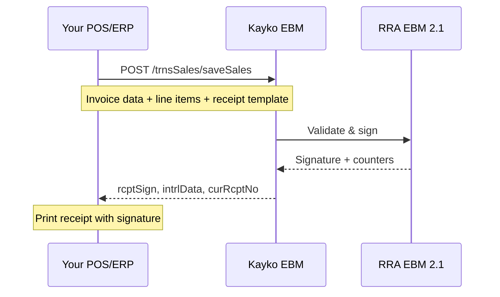

## Overview



## Sale types

All sale types use the same endpoint (`/trnsSales/saveSales`) with different field values:

| Type | `salesTyCd` | `rcptTyCd` | `orgInvcNo` | Notes |
|------|-------------|------------|-------------|-------|
| **Normal sale** | `"N"` | `"S"` | Same as `invcNo` | Standard transaction |
| **Refund** | `"R"` | `"R"` | Original invoice # | Must reference the original sale |
| **Copy** | `"C"` | `"S"` | Original invoice # | Reprint of existing invoice |
| **Training** | `"T"` | `"S"` |- | Practice mode, no legal effect |
| **Proforma** | `"P"` | `"S"` |- | Quote, not a tax document |

---

## Save sale

Submit a sales transaction and receive receipt signature data.

`POST /trnsSales/saveSales`

### Key request fields

<ParamField body="invcNo" type="string" required>Your sequential invoice number</ParamField>
<ParamField body="orgInvcNo" type="string" required>Original invoice number (same as invcNo for normal sales; original sale's number for refunds)</ParamField>
<ParamField body="salesTyCd" type="string" required>`"N"` Normal, `"R"` Refund, `"C"` Copy, `"T"` Training, `"P"` Proforma</ParamField>
<ParamField body="rcptTyCd" type="string" required>`"S"` Sale, `"R"` Refund</ParamField>
<ParamField body="pmtTyCd" type="string" required>Payment method- see [Payment Methods](/reference/enumerations#payment-method)</ParamField>
<ParamField body="salesSttsCd" type="string" required>`"02"` Approved (most common)</ParamField>
<ParamField body="cfmDt" type="string" required>Confirmation datetime (`yyyyMMddHHmmss`)</ParamField>
<ParamField body="salesDt" type="string" required>Sale date (`yyyyMMdd`)</ParamField>
<ParamField body="custTin" type="string">Customer TIN (required for business customers)</ParamField>
<ParamField body="custNm" type="string">Customer name</ParamField>
<ParamField body="prcOrdCd" type="string">Purchase order code- **mandatory for business customers** (v1.0.5+)</ParamField>
<ParamField body="prchrAcptcYn" type="string" required>`"Y"` or `"N"`- buyer accepted goods</ParamField>
<ParamField body="receipt" type="object" required>Receipt template- see below</ParamField>
<ParamField body="itemList" type="array" required>Line items</ParamField>
<ParamField body="totItemCnt" type="number" required>Number of line items</ParamField>
<ParamField body="taxblAmtB" type="number" required>Total taxable amount (category B)</ParamField>
<ParamField body="taxRtB" type="number" required>Tax rate B (typically `18`)</ParamField>
<ParamField body="taxAmtB" type="number" required>Total tax amount B</ParamField>
<ParamField body="totTaxblAmt" type="number" required>Sum of all taxable amounts</ParamField>
<ParamField body="totTaxAmt" type="number" required>Sum of all tax amounts</ParamField>
<ParamField body="totAmt" type="number" required>Grand total</ParamField>

### Receipt object

<ParamField body="receipt.rptNo" type="string" required>Report/receipt number</ParamField>
<ParamField body="receipt.custTin" type="string">Customer TIN on receipt</ParamField>
<ParamField body="receipt.trdeNm" type="string">Customer trade name</ParamField>
<ParamField body="receipt.topMsg" type="string">Header text printed on receipt</ParamField>
<ParamField body="receipt.btmMsg" type="string">Footer text printed on receipt</ParamField>
<ParamField body="receipt.prchrAcptcYn" type="string" required>Purchase acceptance flag</ParamField>

<CodeGroup>

```bash cURL
curl -X POST "{{baseUrl}}/trnsSales/saveSales" \
  -H "Content-Type: application/json" \
  -d '{
    "tin": "100027060",
    "bhfId": "00",
    "invcNo": "1799",
    "orgInvcNo": "1799",
    "cfmDt": "20260303145619",
    "salesDt": "20260303",
    "salesTyCd": "N",
    "rcptTyCd": "S",
    "pmtTyCd": "02",
    "salesSttsCd": "02",
    "prchrAcptcYn": "Y",
    "custNm": "RULIBA CLAYS LTD",
    "custTin": "100004527",
    "totItemCnt": 1,
    "taxRtA": 0, "taxRtB": 18, "taxRtC": 0, "taxRtD": 0,
    "taxblAmtA": 0, "taxblAmtB": 2000, "taxblAmtC": 0, "taxblAmtD": 0,
    "taxAmtA": 0, "taxAmtB": 305.08, "taxAmtC": 0, "taxAmtD": 0,
    "totTaxblAmt": 2000, "totTaxAmt": 305.08, "totAmt": 2000,
    "receipt": {
      "rptNo": "1799",
      "custTin": "100004527",
      "trdeNm": "RULIBACLAYSLTD",
      "topMsg": "SONATUBES Ltd\nADDRESS KIGALI\nTIN 100027060",
      "btmMsg": "Kayko v.2.3.11",
      "prchrAcptcYn": "Y"
    },
    "itemList": [{
      "itemSeq": 1,
      "itemCd": "RW2NTU0000642",
      "itemClsCd": "8014160101",
      "itemNm": "TOLE PL 2 44X1 22X10",
      "taxTyCd": "B",
      "qty": 2,
      "prc": 1000,
      "splyAmt": 2000,
      "taxblAmt": 2000,
      "taxAmt": 305.08,
      "totAmt": 2000,
      "pkg": 1,
      "pkgUnitCd": "NT",
      "qtyUnitCd": "U",
      "dcRt": 0, "dcAmt": 0, "totDcAmt": 0
    }],
    "regrId": "1", "regrNm": "Kayko",
    "modrId": "1", "modrNm": "Kayko"
  }'
```

```javascript JavaScript
const sale = await fetch(`${BASE_URL}/trnsSales/saveSales`, {
  method: 'POST',
  headers: { 'Content-Type': 'application/json' },
  body: JSON.stringify({
    tin: '100027060',
    bhfId: '00',
    invcNo: '1799',
    orgInvcNo: '1799',
    cfmDt: formatDateTime(new Date()),  // yyyyMMddHHmmss
    salesDt: formatDate(new Date()),      // yyyyMMdd
    salesTyCd: 'N',
    rcptTyCd: 'S',
    pmtTyCd: '02',
    salesSttsCd: '02',
    prchrAcptcYn: 'Y',
    custNm: 'RULIBA CLAYS LTD',
    custTin: '100004527',
    totItemCnt: 1,
    taxRtB: 18,
    taxblAmtB: 2000,
    taxAmtB: 305.08,
    totTaxblAmt: 2000,
    totTaxAmt: 305.08,
    totAmt: 2000,
    receipt: {
      rptNo: '1799',
      custTin: '100004527',
      trdeNm: 'RULIBACLAYSLTD',
      topMsg: 'SONATUBES Ltd\nADDRESS KIGALI\nTIN 100027060',
      btmMsg: 'Kayko v.2.3.11',
      prchrAcptcYn: 'Y',
    },
    itemList: [{
      itemSeq: 1,
      itemCd: 'RW2NTU0000642',
      itemClsCd: '8014160101',
      itemNm: 'TOLE PL 2 44X1 22X10',
      taxTyCd: 'B',
      qty: 2,
      prc: 1000,
      splyAmt: 2000,
      taxblAmt: 2000,
      taxAmt: 305.08,
      totAmt: 2000,
      pkg: 1,
      pkgUnitCd: 'NT',
      qtyUnitCd: 'U',
      dcRt: 0, dcAmt: 0, totDcAmt: 0,
    }],
    regrId: '1', regrNm: 'Kayko',
    modrId: '1', modrNm: 'Kayko',
  }),
}).then(r => r.json());

// Use these on your printed receipt:
const { rcptSign, intrlData, curRcptNo, totRcptNo } = sale.data;
```

```php PHP
<?php
$sale = [
    'tin' => '100027060',
    'bhfId' => '00',
    'invcNo' => '1799',
    'orgInvcNo' => '1799',
    'cfmDt' => date('YmdHis'),
    'salesDt' => date('Ymd'),
    'salesTyCd' => 'N',
    'rcptTyCd' => 'S',
    'pmtTyCd' => '02',
    'salesSttsCd' => '02',
    'prchrAcptcYn' => 'Y',
    'custNm' => 'RULIBA CLAYS LTD',
    'custTin' => '100004527',
    'totItemCnt' => 1,
    'taxRtB' => 18,
    'taxblAmtB' => 2000,
    'taxAmtB' => 305.08,
    'totTaxblAmt' => 2000,
    'totTaxAmt' => 305.08,
    'totAmt' => 2000,
    'receipt' => [
        'rptNo' => '1799',
        'custTin' => '100004527',
        'trdeNm' => 'RULIBACLAYSLTD',
        'topMsg' => "SONATUBES Ltd\nADDRESS KIGALI\nTIN 100027060",
        'btmMsg' => 'Kayko v.2.3.11',
        'prchrAcptcYn' => 'Y',
    ],
    'itemList' => [[
        'itemSeq' => 1,
        'itemCd' => 'RW2NTU0000642',
        'itemClsCd' => '8014160101',
        'itemNm' => 'TOLE PL 2 44X1 22X10',
        'taxTyCd' => 'B',
        'qty' => 2,
        'prc' => 1000,
        'splyAmt' => 2000,
        'taxblAmt' => 2000,
        'taxAmt' => 305.08,
        'totAmt' => 2000,
        'pkg' => 1,
        'pkgUnitCd' => 'NT',
        'qtyUnitCd' => 'U',
        'dcRt' => 0, 'dcAmt' => 0, 'totDcAmt' => 0,
    ]],
    'regrId' => '1', 'regrNm' => 'Kayko',
    'modrId' => '1', 'modrNm' => 'Kayko',
];

$response = ebmPost('/trnsSales/saveSales', $sale);
```

```json Payload
{
  "tin": "100027060",
  "bhfId": "00",
  "invcNo": "1799",
  "orgInvcNo": "1799",
  "cfmDt": "20260303145619",
  "salesDt": "20260303",
  "salesTyCd": "N",
  "rcptTyCd": "S",
  "pmtTyCd": "02",
  "salesSttsCd": "02",
  "prchrAcptcYn": "Y",
  "custNm": "RULIBA CLAYS LTD",
  "custTin": "100004527",
  "totItemCnt": 1,
  "taxRtA": 0,
  "taxRtB": 18,
  "taxRtC": 0,
  "taxRtD": 0,
  "taxblAmtA": 0,
  "taxblAmtB": 2000,
  "taxblAmtC": 0,
  "taxblAmtD": 0,
  "taxAmtA": 0,
  "taxAmtB": 305.08,
  "taxAmtC": 0,
  "taxAmtD": 0,
  "totTaxblAmt": 2000,
  "totTaxAmt": 305.08,
  "totAmt": 2000,
  "receipt": {
    "rptNo": "1799",
    "custTin": "100004527",
    "trdeNm": "RULIBACLAYSLTD",
    "topMsg": "SONATUBES Ltd
ADDRESS KIGALI
TIN 100027060",
    "btmMsg": "Kayko v.2.3.11",
    "prchrAcptcYn": "Y"
  },
  "itemList": [
    {
      "itemSeq": 1,
      "itemCd": "RW2NTU0000642",
      "itemClsCd": "8014160101",
      "itemNm": "TOLE PL 2 44X1 22X10",
      "taxTyCd": "B",
      "qty": 2,
      "prc": 1000,
      "splyAmt": 2000,
      "taxblAmt": 2000,
      "taxAmt": 305.08,
      "totAmt": 2000,
      "pkg": 1,
      "pkgUnitCd": "NT",
      "qtyUnitCd": "U",
      "dcRt": 0,
      "dcAmt": 0,
      "totDcAmt": 0
    }
  ],
  "regrId": "1",
  "regrNm": "Kayko",
  "modrId": "1",
  "modrNm": "Kayko"
}
```

</CodeGroup>

### Success response

```json
{
  "resultCd": "000",
  "resultMsg": "It is succeeded",
  "resultDt": "20260303145619",
  "data": {
    "rcptNo": 1799,
    "intrlData": "CUJHWLCUETLWZXS2YR4WKD7WEM",
    "rcptSign": "KYSNC4HM6YROYNI2",
    "totRcptNo": 1321,
    "vsdcRcptPbctDate": "20260303145619",
    "sdcId": "SDC010000005",
    "mrcNo": "WIS01006230"
  }
}
```

Print `rcptSign` and `intrlData` on the receipt — they're required for EBM compliance.

## Refunds

Refunds use the same endpoint with different codes:

| Field | Normal Sale | Refund |
|-------|-------------|--------|
| `salesTyCd` | `"N"` | `"R"` |
| `rcptTyCd` | `"S"` | `"R"` |
| `orgInvcNo` | Same as `invcNo` | **Original sale's** `invcNo` |
| `invcNo` | New sequential # | New sequential # |
| `rfdRsnCd` | `null` | Required — see [Refund Reasons](/reference/enumerations#refund-reason-code) |

---

## Resend sale

Re-submit a sale that was processed locally but failed to reach RRA. Include the **full original payload** with receipt signature data.

`POST /trnsSales/resendSales`

The request body is identical to `saveSales`, but must include these additional receipt fields:

<ParamField body="receipt.rcptSign" type="string" required>Original receipt signature</ParamField>
<ParamField body="receipt.intrlData" type="string" required>Original internal data</ParamField>
<ParamField body="receipt.curRcptNo" type="number" required>Original current receipt number</ParamField>
<ParamField body="receipt.totRcptNo" type="number" required>Original total receipt number</ParamField>
<ParamField body="receipt.rcptPbctDt" type="string" required>Original receipt published date</ParamField>

<CodeGroup>

```bash cURL
curl -X POST "{{baseUrl}}/trnsSales/resendSales" \
  -H "Content-Type: application/json" \
  -d @resend-payload.json
```

```javascript JavaScript
// Same payload as saveSales, plus receipt signature fields
await ebmPost('/trnsSales/resendSales', {
  ...originalSalePayload,
  receipt: {
    ...originalSalePayload.receipt,
    rcptSign: 'P3SKYWLKGFJXFPXZ',
    intrlData: '2BGSI4XVCRPNPO32PTAZOLND5M',
    curRcptNo: 257,
    totRcptNo: 257,
    rcptPbctDt: '20260609101449',
  },
});
```

```php PHP
<?php
ebmPost('/trnsSales/resendSales', $resendPayload);
```

```json Payload
{
  "tin": "107993488",
  "bhfId": "01",
  "cfmDt": "20260609101449",
  "rfdDt": null,
  "cnclDt": null,
  "custNm": "Customer",
  "invcNo": "257",
  "modrId": "1",
  "modrNm": "Kayko",
  "regrId": "1",
  "regrNm": "Kayko",
  "remark": null,
  "taxRtA": 0,
  "taxRtB": 18,
  "taxRtC": 0,
  "taxRtD": 0,
  "totAmt": 1580000,
  "custTin": "788312173",
  "pmtTyCd": "06",
  "receipt": {
    "adrs": null,
    "rptNo": "257",
    "btmMsg": "Kayko v.2.3.11",
    "topMsg": "SMATCONS Ltd
ADDRESS Remera, Gasabo, Umujyi wa Kigali, RWANDA
PHONE +250781620053

TIN 107993488
",
    "trdeNm": "Customer",
    "custTin": null,
    "rcptSign": "P3SKYWLKGFJXFPXZ",
    "curRcptNo": 257,
    "custMblNo": "788312173",
    "intrlData": "2BGSI4XVCRPNPO32PTAZOLND5M",
    "totRcptNo": 257,
    "rcptPbctDt": "20260609101449",
    "prchrAcptcYn": "Y"
  },
  "salesDt": "20260609",
  "taxAmtA": 0,
  "taxAmtB": "241016.95",
  "taxAmtC": 0,
  "taxAmtD": 0,
  "itemList": [
    {
      "bcd": null,
      "pkg": 1,
      "prc": "15800.00",
      "qty": "100.00",
      "dcRt": "0.00",
      "dcAmt": "0.00",
      "isrcRt": null,
      "itemCd": "RW2NTU0000001",
      "itemNm": "Cimerwa cement 32.5",
      "taxAmt": "241016.95",
      "totAmt": "1580000.00",
      "isrcAmt": null,
      "isrccCd": null,
      "isrccNm": null,
      "itemSeq": 1,
      "splyAmt": "1580000.00",
      "taxTyCd": "B",
      "taxblAmt": "1580000.00",
      "totDcAmt": "0.00",
      "itemClsCd": "8014160101",
      "pkgUnitCd": "NT",
      "qtyUnitCd": "U"
    }
  ],
  "prcOrdCd": null,
  "rcptTyCd": "R",
  "rfdRsnCd": "04",
  "cnclReqDt": null,
  "custPhone": "788312173",
  "orgInvcNo": "67",
  "salesTyCd": "N",
  "taxblAmtA": 0,
  "taxblAmtB": 1580000,
  "taxblAmtC": 0,
  "taxblAmtD": 0,
  "totTaxAmt": "241016.95",
  "stockRlsDt": null,
  "totItemCnt": 1,
  "salesSttsCd": "04",
  "totTaxblAmt": 1580000,
  "prchrAcptcYn": "Y"
}
```

</CodeGroup>

## Business rules

<AccordionGroup>
  <Accordion title="prcOrdCd — Purchase Order Code (v1.0.5+)">
    Mandatory when the customer is a **registered business** (has a TIN). Optional for individual/walk-in customers. Missing this for business customers returns error `881`.
  </Accordion>
  <Accordion title="regrNm / modrNm — max 8 characters">
    The registrant and modifier names must not exceed 8 characters on sales transactions.
  </Accordion>
  <Accordion title="Invoice numbers must be sequential">
    `invcNo` must increment. Use the `lastSaleInvcNo` from initialization to know where to start.
  </Accordion>
  <Accordion title="Customer TIN validation">
    Invalid customer TINs return error `884`. Use `/customers/selectCustomer` to verify before selling.
  </Accordion>
</AccordionGroup>

## See also

- [Calculations](/calculations/overview) — how to compute amounts
- [Response Codes](/reference/response-codes) — error handling
- [Stock](/api/stock) — record stock-out after a sale
