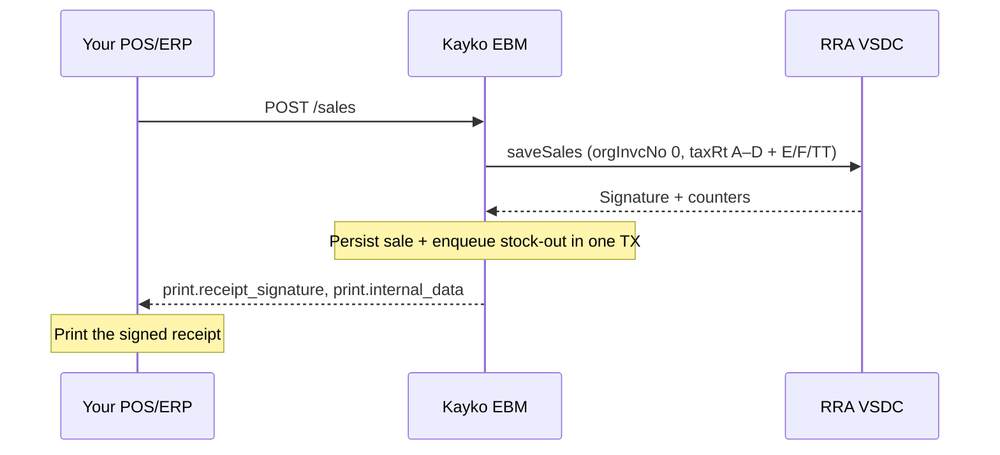

Send `x-tin` and `x-branch-id` on every route below. Kayko resolves `ebm_url` from your business after Enable EBM, so you never put it in the JSON body.

Requires a business API key with scope `sales`. Any allowed branch may sell.



Register items first. Unknown `item_code` returns `EBM_ITEM_NOT_REGISTERED`.

Kayko **does not** post stock in the same HTTP request as the sale. After VSDC `000`, stock-out is queued and sent later. Seed remaining quantity with `POST /stocks/master` so the ledger can update. Services (`item_type` `3`) skip stock.

---

## Submit sale

`POST /sales`

A normal sale is always transaction type `N` and receipt type `S`. Kayko sends upstream **`orgInvcNo: 0`**. Do not set `original_invoice_no` equal to `invoice_no` — that causes VSDC `910`.

Refunds use `POST /sales/refund`, not this route.

<ParamField body="invoice_no" type="integer" required>Your sequential invoice number</ParamField>
<ParamField body="payment_method" type="string" required>`cash`, `credit`, `cash_credit`, `bank_check`, `card`, `mobile_money`, or `other`</ParamField>
<ParamField body="items" type="array" required>Line items</ParamField>
<ParamField body="customer_tin" type="string">9-digit TIN (required for business customers)</ParamField>
<ParamField body="customer_name" type="string">Customer name</ParamField>
<ParamField body="customer_phone" type="string">Phone</ParamField>
<ParamField body="purchase_order_code" type="string">Max 6. **Required for business customers** (v1.0.5)</ParamField>
<ParamField body="status" type="string">Usually `approved`</ParamField>
<ParamField body="sales_date" type="string">`YYYYMMDD`; defaults to today</ParamField>
<ParamField body="confirmed_at" type="string">`YYYYMMDDHHmmss`</ParamField>
<ParamField body="buyer_accepted" type="boolean">Defaults to accepted when omitted</ParamField>
<ParamField body="notes" type="string">Optional notes</ParamField>
<ParamField body="receipt" type="object">Optional print template (header/footer, trade name)</ParamField>

Optional header buckets: `taxable_amount_a` … `taxable_amount_tt`, `tax_amount_*`, `total_taxable_amount`, `total_tax_amount`, `total_amount`. Omit them to let Kayko compute from lines. If you send them, they must match line math or VSDC returns `910`.

Kayko always forwards live tax **rates** to VSDC as NUMBER 7,2 (for example `"taxRtB":18.00`, `"taxRtF":3.00`, `"taxRtTt":3.00`). Spec PDF v1.0.5 documents A–D only; current devices also require **E** (reserved, 0%), **F** (tourism tax, 3%), and **TT** (3%).

### Line items

| Field | Required | Notes |
|-------|----------|-------|
| `item_code` | Y | Must be registered |
| `item_name` | Y | |
| `packaging_unit` | Y | |
| `packages` | Y | |
| `quantity_unit` | Y | |
| `quantity` | Y | Positive |
| `price` | Y | Tax-inclusive unit price |
| `tax_type` | Y | Usually `B` (18% VAT) |
| `item_classification_code` | N | Filled from catalog when omitted |
| `supply_amount`, `discount_rate`, `discount_amount`, `taxable_amount`, `tax_amount`, `total_amount` | N | Computed if omitted |

Category B VAT is extracted as `taxable_amount × 18 / 118`, rounded to 2 decimals. See [VAT Formulas](/calculations/vat-formulas).

<CodeGroup>

```bash cURL
curl -X POST "{{baseUrl}}/sales" \
  -H "Content-Type: application/json" \
  -H "Authorization: Bearer sk_live_YOUR_SECRET" \
  -H "x-tin: 100027060" \
  -H "x-branch-id: 00" \
  -d '{
    "invoice_no": 1799,
    "payment_method": "credit",
    "customer_tin": "100004527",
    "customer_name": "RULIBA CLAYS LTD",
    "purchase_order_code": "PO0001",
    "sales_date": "20260303",
    "items": [{
      "item_code": "RW2NTU0000642",
      "item_name": "TOLE PL 2 44X1 22X10",
      "packaging_unit": "NT",
      "packages": 1,
      "quantity_unit": "U",
      "quantity": 2,
      "price": 1000,
      "tax_type": "B"
    }]
  }'
```

```javascript JavaScript
await fetch(`${BASE_URL}/sales`, {
  method: 'POST',
  headers: {
    'Content-Type': 'application/json',
    Authorization: `Bearer ${process.env.KAYKO_EBM_API_KEY}`,
    'x-tin': '100027060',
    'x-branch-id': '00',
  },
  body: JSON.stringify({
    invoice_no: 1799,
    payment_method: 'credit',
    customer_tin: '100004527',
    customer_name: 'RULIBA CLAYS LTD',
    purchase_order_code: 'PO0001',
    sales_date: '20260303',
    items: [
      {
        item_code: 'RW2NTU0000642',
        item_name: 'TOLE PL 2 44X1 22X10',
        packaging_unit: 'NT',
        packages: 1,
        quantity_unit: 'U',
        quantity: 2,
        price: 1000,
        tax_type: 'B',
      },
    ],
  }),
});
```

```json Payload
{
  "invoice_no": 1799,
  "payment_method": "credit",
  "customer_tin": "100004527",
  "customer_name": "RULIBA CLAYS LTD",
  "purchase_order_code": "PO0001",
  "sales_date": "20260303",
  "items": [
    {
      "item_code": "RW2NTU0000642",
      "item_name": "TOLE PL 2 44X1 22X10",
      "packaging_unit": "NT",
      "packages": 1,
      "quantity_unit": "U",
      "quantity": 2,
      "price": 1000,
      "tax_type": "B"
    }
  ]
}
```

</CodeGroup>

Success:

```json
{
  "message": "success",
  "data": {
    "invoice_no": 1799,
    "original_invoice_no": 0,
    "receipt_type": "sale",
    "status": "approved",
    "replayed": false,
    "print": {
      "receipt_no": 12,
      "total_receipt_no": 12,
      "internal_data": "…",
      "receipt_signature": "…",
      "receipt_published_at": "20260303145619",
      "sdc_id": "SDC001",
      "mrc_no": "MRC001"
    }
  }
}
```

Print `print.receipt_signature` and `print.internal_data` on the customer receipt.

### Persist failure (already signed)

If VSDC returns `000` but Kayko cannot persist the sale locally, you get **HTTP 503** with `error: EBM_SALE_PERSIST_FAILED` plus the signature fields. The sale **is signed** — do not submit a new invoice number. Retry with `POST /sales/resend` using those fields.

Sales also require the local store (`DATABASE_URL`). If it is down, Kayko does not call VSDC and returns `EBM_SALES_STORE_UNAVAILABLE`.

---

## Refund sale

`POST /sales/refund`

Same line payload as a sale, plus:

<ParamField body="invoice_no" type="integer" required>New refund invoice number (not the original)</ParamField>
<ParamField body="original_invoice_no" type="integer" required>The original sale invoice number</ParamField>
<ParamField body="refund_reason" type="string" required>Label from `GET /constants/refund-reasons`, e.g. `wrong_quantity`, `damaged`, `other`</ParamField>
<ParamField body="refunded_at" type="string">`YYYYMMDDHHmmss`</ParamField>

Kayko sends upstream receipt type `R` and `orgInvcNo` = original invoice. Stock-in for the refund is queued after `000` (`sarTyCd` `03`). If the original stock link is not ready yet, Kayko retries instead of posting `orgSarNo: 0`.

```json
{
  "invoice_no": 1800,
  "original_invoice_no": 1799,
  "payment_method": "credit",
  "refund_reason": "wrong_quantity",
  "items": [
    {
      "item_code": "RW2NTU0000642",
      "item_name": "TOLE PL 2 44X1 22X10",
      "packaging_unit": "NT",
      "packages": 1,
      "quantity_unit": "U",
      "quantity": 2,
      "price": 1000,
      "tax_type": "B"
    }
  ]
}
```

---

## Resend sale

`POST /sales/resend`

Use this when VSDC already signed the invoice (`EBM_SALE_PERSIST_FAILED`, or you need to replay a stored signature).

<ParamField body="invoice_no" type="integer" required>The signed invoice number</ParamField>
<ParamField body="receipt" type="object">Optional. Include `receipt_signature`, `internal_data`, `receipt_no`, `total_receipt_no`, `receipt_published_at` from the 503 body or from `GET /sales/:invoice_no`.</ParamField>

Other sale fields are optional on resend; send the original lines if Kayko still needs them to rebuild the VSDC payload.

---

## Get sale

`GET /sales/:invoice_no`

Returns the stored invoice and print fields.

```bash
curl -X GET "{{baseUrl}}/sales/1799" \
  -H "Authorization: Bearer sk_live_YOUR_SECRET" \
  -H "x-tin: 100027060" \
  -H "x-branch-id: 00"
```
