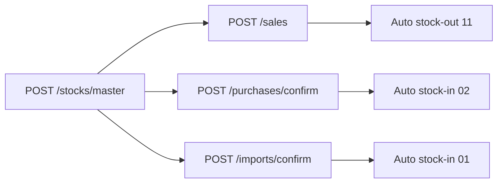

Send `x-tin` and `x-branch-id` on every route below. Kayko resolves `ebm_url` from your business after Enable EBM, so you never put it in the JSON body.

Requires a business API key with scope `stocks`. Any allowed branch may call these routes.

Kayko posts stock **after** a signed sale, confirmed purchase, or approved import, as a **later independent VSDC call**. A failed stock post does not roll back a sale that already returned `000`. Do not nest a stock save in the same HTTP request as sale / purchase / import confirm.

Seed **remaining quantity** with `POST /stocks/master` first. Auto movements update the ledger **only if** a master row already exists. `remaining_quantity` is the **absolute** on-hand quantity, not a delta. Negative values are rejected.

Services (`item_type` `service`, upstream `3`) never generate stock movements.

---

## What Kayko posts automatically

| Trigger | After VSDC `000` | Stock type (upstream) |
|---------|------------------|------------------------|
| Sale | Stock-out | `11` Sale |
| Sale refund | Stock-in | `03` Return |
| Purchase confirm | Stock-in | `02` Purchase |
| Purchase refund | Stock-out | `12` Return |
| Import confirm (`approved`) | Stock-in | `01` Import |
| Import confirm (`cancelled`) | Skipped | |

Import confirm has no quantity; Kayko uses quantity from `GET /imports`. Refunds wait for the original movement number (`orgSarNo`) instead of sending `0`.

Use `POST /stocks` only for **manual** adjustments (processing, discarding, transfers, corrections) that are not covered by the automatic chain.

---

## List stock movements

`GET /stocks`

Send `x-last-request-date` (`YYYYMMDDHHmmss`). First sync: `20000101000000`.

Response: `{ message, data: Movement[] }`. Empty lists return `{ "message": "No stock movements found", "data": [] }`.

Each movement includes `sar_no`, `original_sar_no`, `stock_type` (label), `direction` (`in` / `out`), `occurrence_date`, and `items[]`.

---

## Save stock count

`POST /stocks/master`

Call this once per item (and after large physical counts) so remaining quantity is known before auto movements run.

<ParamField body="item_code" type="string" required>Registered item code</ParamField>
<ParamField body="remaining_quantity" type="number" required>Absolute remaining quantity (2 decimals, not negative)</ParamField>

Success returns `{ message, data }` with `item_code` and `remaining_quantity`.

---

## Save stock movement (manual)

`POST /stocks`

<ParamField body="sar_no" type="integer" required>Your stock-and-release document number</ParamField>
<ParamField body="stock_type" type="string" required>Label, e.g. `sale`, `purchase`, `import`, `adjustment`, `processing`, `discarding`, `return`. Transfers use movement types that require `customer_tin` / `customer_branch_id`.</ParamField>
<ParamField body="occurrence_date" type="string" required>`YYYYMMDD`</ParamField>
<ParamField body="items" type="array" required>Movement lines</ParamField>
<ParamField body="original_sar_no" type="integer">Original movement number (refunds / reversals)</ParamField>
<ParamField body="registration_type" type="string">`automatic` or `manual`</ParamField>
<ParamField body="customer_tin" type="string">Required for branch transfers</ParamField>
<ParamField body="customer_branch_id" type="string">Required for branch transfers (2 chars)</ParamField>
<ParamField body="customer_name" type="string">Counterparty name</ParamField>
<ParamField body="notes" type="string">Optional notes</ParamField>

Line fields: `item_code`, `item_classification_code`, `item_name`, `packaging_unit`, `packages`, `quantity_unit`, `quantity`, `price`, `tax_type`. Amounts (`supply_amount`, `taxable_amount`, `tax_amount`, `total_amount`) are optional and computed when omitted.

Header `item_count`, `total_taxable_amount`, `total_tax_amount`, and `total_amount` are calculated from `items`, do not send them.

`sequence` is optional. Omit it to auto-number lines `1…n` in array order. If you send it, values must be consecutive starting at `1` matching that order.

Response `{ message, data }` includes `sar_no`, `original_sar_no`, `stock_type`, and `registration_type`.

Codes and directions: [Stock In/Out Type](/reference/enumerations#stock-inout-type) and `GET /constants/stock-types`.
