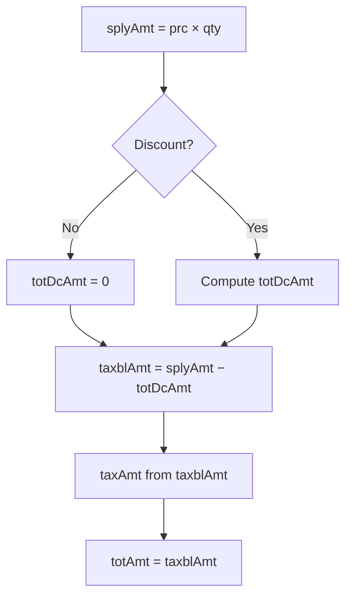

Discounts reduce the taxable base before VAT is extracted. Every line item carries three discount fields:

| Field | Full name | Type | Description |
|-------|-----------|------|-------------|
| `dcRt` | Discount rate | % | Percentage discount (0–100) |
| `dcAmt` | Discount amount | RWF | Absolute discount value |
| `totDcAmt` | Total discount amount | RWF | Total discount applied to the line |

When no discount applies, set all three to `0`.

## Calculation order



## Percentage discount

When applying a percentage discount via `dcRt`:

```
dcAmt     = ROUND(splyAmt × dcRt / 100, 2)
totDcAmt  = dcAmt
taxblAmt  = splyAmt − totDcAmt
```

### Example- 10% off

| Field | Calculation | Value |
|-------|-------------|-------|
| `prc` | Unit price | 1,000.00 |
| `qty` | Quantity | 2 |
| `splyAmt` | `1000 × 2` | 2,000.00 |
| `dcRt` | 10% discount | 10.00 |
| `dcAmt` | `2000 × 10/100` | 200.00 |
| `totDcAmt` | Same as `dcAmt` | 200.00 |
| `taxblAmt` | `2000 − 200` | 1,800.00 |
| `taxAmt` | `1800 × 18/118` | **274.58** |
| `totAmt` | `taxblAmt` | 1,800.00 |

## Fixed amount discount

When applying a flat discount via `dcAmt` directly:

```
totDcAmt = dcAmt
dcRt     = ROUND(dcAmt / splyAmt × 100, 2)   (optional, for display)
taxblAmt = splyAmt − totDcAmt
```

### Example- 500 RWF off

| Field | Value |
|-------|-------|
| `splyAmt` | 2,000.00 |
| `dcAmt` | 500.00 |
| `totDcAmt` | 500.00 |
| `taxblAmt` | 1,500.00 |
| `taxAmt` | 228.81 (`1500 × 18/118`) |
| `totAmt` | 1,500.00 |

## VAT after discount

VAT is always calculated on the **post-discount** `taxblAmt`:

```
taxAmt = ROUND(taxblAmt × 18 / 118, 2)    // category B only
```

<Warning>
  Never calculate VAT on the pre-discount `splyAmt`. RRA expects tax on what the customer actually pays.
</Warning>

## Header impact

Discounts affect header totals indirectly- through reduced line `taxblAmt` and `taxAmt` values:

```
taxblAmtB = Σ (taxblAmt for all lines where taxTyCd = "B")
taxAmtB   = Σ (taxAmt for all lines where taxTyCd = "B")
totAmt    = Σ (totAmt for all lines)
```

There is no separate header discount field. All discount logic lives at the line level.

## No discount (most common)

```json
{
  "dcRt": 0,
  "dcAmt": 0,
  "totDcAmt": 0,
  "splyAmt": 2000,
  "taxblAmt": 2000,
  "taxAmt": 305.08,
  "totAmt": 2000
}
```
