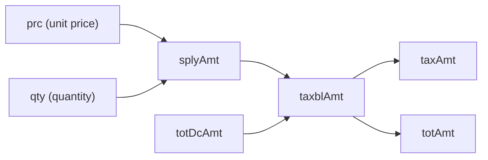

Every transaction with an `itemList` array- sales, purchases, and stock- computes amounts **per line** before rolling up to the invoice header.

## Field relationships



## Core formula

```
splyAmt = prc × qty
```

Both `prc` and `qty` support up to 2 decimal places. The result `splyAmt` is rounded to **2 decimal places**.

### Example- normal sale

From a Kayko sale payload:

| Field | Value | Notes |
|-------|-------|-------|
| `prc` | 1,000.00 | Tax-inclusive unit price |
| `qty` | 2 | Units sold |
| `splyAmt` | 2,000.00 | `1000 × 2` |
| `taxTyCd` | `"B"` | 18% VAT category |
| `taxblAmt` | 2,000.00 | Taxable base (after discount) |
| `taxAmt` | 305.08 | `2000 × 18/118` |
| `totAmt` | 2,000.00 | Line total |

## Packaging fields

Lines also carry packaging metadata. These do **not** affect tax math directly but are required for compliance:

| Field | Description | Example |
|-------|-------------|---------|
| `pkg` | Number of packages | `1` |
| `pkgUnitCd` | Packaging unit code | `"NT"` (net) |
| `qtyUnitCd` | Quantity unit code | `"U"` (pieces) |
| `qty` | Quantity in `qtyUnitCd` | `2` |

See [packaging](/reference/enumerations#packaging-unit-full-list) and [quantity](/reference/enumerations#unit-of-quantity-full-list) unit codes on the Items API page.

## Taxable amount (`taxblAmt`)

After computing `splyAmt`, apply any discount:

```
taxblAmt = splyAmt − totDcAmt
```

When there is no discount (`totDcAmt = 0`):

```
taxblAmt = splyAmt
```

See [Discounts](/calculations/discounts) for discount formulas.

## Tax amount (`taxAmt`)

Depends on `taxTyCd`:

| `taxTyCd` | Formula |
|-----------|---------|
| `"B"` | `ROUND(taxblAmt × 18 / 118, 2)` |
| `"A"`, `"C"`, `"D"` | `0` |

## Line total (`totAmt`)

For tax-inclusive category B:

```
totAmt = taxblAmt
```

The customer pays `totAmt` per line. VAT is embedded inside- it is not added separately.

## Insurance fields (pharmacy)

Pharmacy integrations may include insurance coverage on a line:

| Field | Description |
|-------|-------------|
| `isrccCd` | Insurance company code |
| `isrccNm` | Insurance company name |
| `isrcRt` | Insurance coverage rate (%) |
| `isrcAmt` | Insurance-covered amount |

When insurance applies:

```
isrcAmt = ROUND(taxblAmt × isrcRt / 100, 2)
```

The patient pays the remainder: `taxblAmt − isrcAmt`. Both the full `taxblAmt` and `taxAmt` are still reported to RRA on the full line value.

## Line item checklist

Before submitting any `itemList` entry, verify:

- [ ] `splyAmt = prc × qty` (2 dp)
- [ ] `taxblAmt = splyAmt − totDcAmt`
- [ ] `taxAmt` matches the [VAT formula](/calculations/vat-formulas) for the line's `taxTyCd`
- [ ] `totAmt = taxblAmt`
- [ ] `taxTyCd` matches the item's registered tax type from `saveItems`
- [ ] `itemCd`, `itemClsCd`, `pkgUnitCd`, `qtyUnitCd` are valid registered codes
