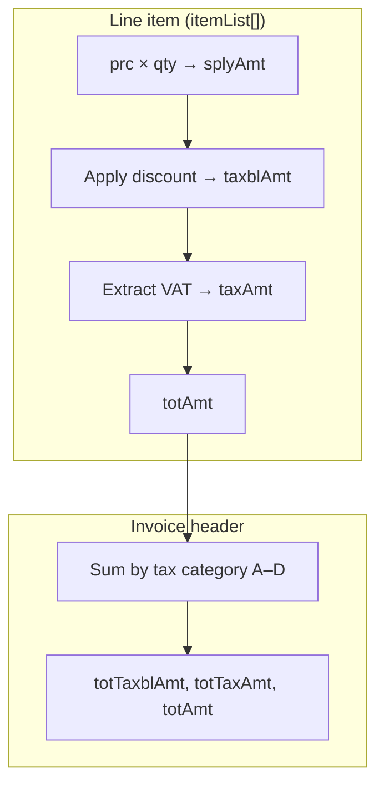

---


## Calculation layers



## Pages in this section

<CardGroup cols={2}>
  <Card title="VAT Formulas" icon="percent" href="/calculations/vat-formulas">
    Tax categories A–D, the 18/118 extraction formula, and multi-category invoices.
  </Card>
  <Card title="Line Items" icon="list" href="/calculations/line-items">
    `prc`, `qty`, `splyAmt`, packaging, and per-line totals.
  </Card>
  <Card title="Discounts" icon="tag" href="/calculations/discounts">
    `dcRt`, `dcAmt`, `totDcAmt` and how discounts affect taxable amounts.
  </Card>
  <Card title="Invoice Totals" icon="file-invoice" href="/calculations/invoice-totals">
    Header aggregation: `taxblAmtB`, `totTaxAmt`, and consistency rules.
  </Card>
  <Card title="Stock & Purchases" icon="boxes-stacked" href="/calculations/stock-and-purchases">
    Stock movement amounts and purchase confirmation math.
  </Card>
</CardGroup>

## Golden rules

<Warning>
  **Always use 2 decimal places.** Amounts like `305.08` are correct; `305` or `305.085` will fail validation.
</Warning>

| Rule | Detail |
|------|--------|
| Tax-inclusive pricing | Rwanda EBM uses **tax-inclusive** prices for category B. VAT is **extracted**, not added on top. |
| Header = sum of lines | Every `taxblAmt*` and `taxAmt*` header field must equal the sum of matching line items. |
| `taxTyCd` drives category | A line with `taxTyCd: "B"` contributes to `taxblAmtB` / `taxAmtB`, not A. |
| `totAmt` consistency | Header `totAmt` must equal the sum of all line `totAmt` values. |
| Round at each step | Round each line's `taxAmt` to 2 dp **before** summing into header totals. |

## Quick reference- category B (18% VAT)

For the most common case (`taxTyCd: "B"`):

```
splyAmt     = prc × qty
taxblAmt    = splyAmt − totDcAmt        (after discount)
taxAmt      = ROUND(taxblAmt × 18 / 118, 2)
totAmt      = taxblAmt                   (tax-inclusive- customer pays this)
```

See [VAT Formulas](/calculations/vat-formulas) for the full breakdown.
