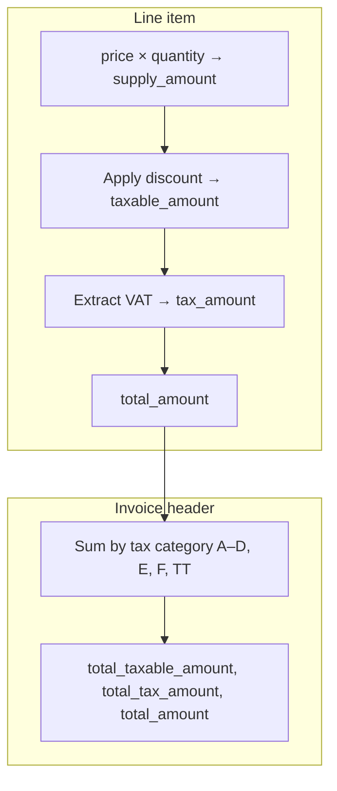

---


## Calculation layers



## Pages in this section

<CardGroup cols={2}>
  <Card title="VAT Formulas" icon="percent" href="/calculations/vat-formulas">
    Tax categories A–D plus E/F/TT, the 18/118 extraction formula, and multi-category invoices.
  </Card>
  <Card title="Line Items" icon="list" href="/calculations/line-items">
    `price`, `quantity`, `supply_amount`, packaging, and per-line totals.
  </Card>
  <Card title="Discounts" icon="tag" href="/calculations/discounts">
    Discount rate/amount and how discounts affect taxable amounts.
  </Card>
  <Card title="Invoice Totals" icon="file-invoice" href="/calculations/invoice-totals">
    Header aggregation: `taxable_amount_b`, `total_tax_amount`, and consistency rules.
  </Card>
  <Card title="Stock & Purchases" icon="boxes-stacked" href="/calculations/stock-and-purchases">
    Automatic stock after VSDC 000, master remaining quantity, and purchase confirm math.
  </Card>
</CardGroup>

## Golden rules

<Warning>
  **Always use 2 decimal places.** Amounts like `305.08` are correct; `305` or `305.085` will fail validation.
</Warning>

| Rule | Detail |
|------|--------|
| Tax-inclusive pricing | Rwanda EBM uses **tax-inclusive** prices for category B. VAT is **extracted**, not added on top. |
| Header = sum of lines | Every `taxable_amount_*` and `tax_amount_*` header field must equal the sum of matching line items. |
| `tax_type` drives category | A line with `tax_type: "B"` contributes to `taxable_amount_b` / `tax_amount_b`, not A. |
| `total_amount` consistency | Header `total_amount` must equal the sum of all line `total_amount` values. |
| Round at each step | Round each line's `tax_amount` to 2 dp **before** summing into header totals. |
| Live rates E/F/TT | Kayko sends `taxRtF: 3.00` and `taxRtTt: 3.00` even when those buckets are 0. |

## Quick reference- category B (18% VAT)

For the most common case (`tax_type: "B"`):

```
supply_amount     = price × quantity
taxable_amount    = supply_amount − total_discount_amount
tax_amount        = ROUND(taxable_amount × 18 / 118, 2)
total_amount      = taxable_amount                   (tax-inclusive — customer pays this)
```

Kayko computes these when you omit them on `POST /sales` / `POST /purchases/confirm`. See [VAT Formulas](/calculations/vat-formulas) for the full breakdown.
