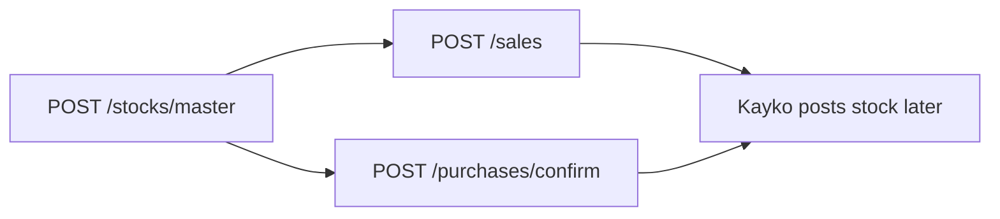

Stock and purchase amounts use the **same tax math** as sales ([VAT Formulas](/calculations/vat-formulas)). The difference is **when** Kayko posts stock.

## Automatic stock (do not nest in sale/purchase)

After VSDC `000` on a sale, purchase confirm, or approved import, Kayko posts stock as a **later** request. You do not calculate or send that movement on the original HTTP call.

| Trigger | Direction | Upstream `sarTyCd` |
|---------|-----------|--------------------|
| Sale | out | `11` |
| Sale refund | in | `03` |
| Purchase | in | `02` |
| Purchase refund | out | `12` |
| Import approved | in | `01` |

Services (`item_type` `service`) are skipped. Import confirm has no qty; quantity comes from `GET /imports`.

### Remaining quantity (`POST /stocks/master`)

Stock master stores **absolute remaining quantity**, not a delta:

```
remaining_quantity = on-hand count after the physical count
```

Seed master **before** you sell or confirm, so later automatic movements can update the ledger. Kayko updates remaining quantity only when a master row already exists. Negative remaining quantity is rejected.



## Manual stock (`POST /stocks`)

Use this for adjustments, processing, discarding, and transfers that are not produced by the automatic chain.

Line math matches sales:

```
supply_amount   = price × quantity
taxable_amount  = supply_amount − total_discount_amount
tax_amount      = ROUND(taxable_amount × 18 / 118, 2)   // tax_type B
total_amount    = taxable_amount
```

`price` on stock is a **valuation** price. Tax formulas still apply to the `taxable_amount` you report (or that Kayko computes).

## Purchase confirmation (`POST /purchases/confirm`)

Pull invoices with `GET /purchases`, map each line to **your** `item_code`, then confirm.

```
taxable_amount = supply_amount − discount
tax_amount     = ROUND(taxable_amount × 18 / 118, 2)   // if tax_type = B
total_amount   = taxable_amount
```

Normal purchases send upstream `orgInvcNo: 0`. Refunds send `receipt_type: refund` and `original_invoice_no`.

When pulling, the supplier's amounts are authoritative. When confirming, your payload must be internally consistent even if `price × quantity ≠ taxable_amount`.

## Related pages

- [VAT Formulas](/calculations/vat-formulas)
- [Invoice Totals](/calculations/invoice-totals)
- [Stock](/api/stock)
- [Purchases](/api/purchases)
