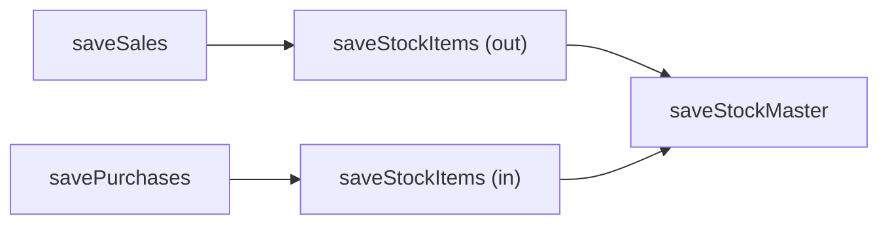

Stock and purchase endpoints use the **same tax math** as sales. The difference is in **which fields** carry the amounts and **when** you submit them.

## Stock movement (`saveStockItems`)

Stock records inventory in/out after a sale or purchase. Amounts follow identical line-item and header rules.

### Example- stock out after a sale

From the stock example payload:

| Field | Value | Formula |
|-------|-------|---------|
| `sarTyCd` | `"11"` | Stock adjustment type (out) |
| `qty` | 50 | Units moved |
| `prc` | 10,000.00 | Unit valuation price |
| `splyAmt` | 1,000.00 | Value of this movement |
| `taxTyCd` | `"B"` | 18% VAT |
| `taxblAmt` | 1,000.00 | Taxable base |
| `taxAmt` | 152.54 | `1000 × 18/118` |
| `totAmt` | 1,000.00 | Movement total |

**Header:**

| Field | Value |
|-------|-------|
| `totTaxblAmt` | 1,000.00 |
| `totTaxAmt` | 152.54 |
| `totAmt` | 1,000.00 |
| `totItemCnt` | 1 |

<Note>
  Stock `prc` is a **valuation price** per unit, not necessarily the sale price. The `splyAmt` on stock lines is the total value of the stock movement, which may be computed differently from `prc × qty` depending on your inventory valuation method. The tax formulas still apply to whatever `taxblAmt` you report.
</Note>

### Stock type codes (`sarTyCd`)

| Code | Direction | Typical trigger |
|------|-----------|-----------------|
| `"02"` | Stock in | Purchase confirmed |
| `"11"` | Stock out | Sale completed |
| `"03"` | Adjustment | Manual correction |

## Stock master (`saveStockMaster`)

Stock master tracks **current quantity** per item- not monetary amounts. The key calculation is quantity arithmetic:

```
newQty = previousQty + stockInQty − stockOutQty
```

| Field | Description |
|-------|-------------|
| `itemCd` | Product code |
| `rsdQty` | Residual (remaining) quantity |
| `regrNm` / `modrNm` | Audit fields |

Submit stock master **after** `saveStockItems` to keep EBM inventory in sync with your ERP.



## Purchase confirmation (`savePurchases`)

When you confirm a supplier invoice pulled via `selectTrnsPurchaseSales`, you recalculate or verify amounts before submitting.

### Purchase line amounts

Purchase lines include supplier cross-reference fields:

| Field | Description |
|-------|-------------|
| `spplrItemCd` | Supplier's item code |
| `spplrItemClsCd` | Supplier's classification |
| `spplrItemNm` | Supplier's item name |

Tax math is identical to sales:

```
taxblAmt = splyAmt − totDcAmt
taxAmt   = ROUND(taxblAmt × 18 / 118, 2)   // if taxTyCd = "B"
totAmt   = taxblAmt
```

### Purchase header example

Confirming a supplier invoice for 8,000 RWF (all category B):

```json
{
  "taxblAmtB": 8000,
  "taxRtB": 18,
  "taxAmtB": 1220.34,
  "totTaxblAmt": 8000,
  "totTaxAmt": 1220.34,
  "totAmt": 8000,
  "totItemCnt": 2
}
```

Verification: `8000 × 18/118 = 1220.339…` → **1220.34** ✓

## Pull vs push amounts

| Endpoint | Direction | Amounts |
|----------|-----------|---------|
| `selectTrnsPurchaseSales` | Pull from RRA | Pre-calculated by supplier's EBM system |
| `savePurchases` | Push confirmation | You verify or recalculate before submit |
| `selectStockItems` | Pull | Current stock movement history |
| `saveStockItems` | Push | You calculate movement values |

When pulling purchases, the supplier's `taxblAmt` and `taxAmt` are authoritative. When confirming, your submitted values must be internally consistent even if `prc × qty ≠ taxblAmt` (supplier may report lump-sum line totals).

## End-to-end calculation flow

<Steps>
  <Step title="Sale">
    Calculate line amounts → aggregate header → `saveSales`
  </Step>
  <Step title="Stock out">
    Record movement with matching tax amounts → `saveStockItems`
  </Step>
  <Step title="Update master">
    Reduce `rsdQty` → `saveStockMaster`
  </Step>
  <Step title="Purchase">
    Pull supplier invoice → verify amounts → `savePurchases`
  </Step>
  <Step title="Stock in">
    Record incoming stock → `saveStockItems` → update master
  </Step>
</Steps>

## Related pages

- [VAT Formulas](/calculations/vat-formulas)- the 18/118 extraction
- [Invoice Totals](/calculations/invoice-totals)- header aggregation
- [Stock](/api/stock) — step-by-step guide
- [Purchases](/api/purchases) — purchase confirmation flow
