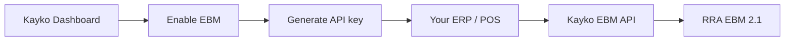

Kayko protects EBM access with a **business API key**. Device initialization still issues RRA signing keys (`intrlKey`, `signKey`, `cmcKey`) — those are for receipt crypto. The API key is what your integration sends on **every** request to prove it belongs to your business.



## Get an API key (dashboard)

<Steps>
  <Step title="Open your Kayko business dashboard">
    Sign in as a user who can manage business settings for the company you are integrating.
  </Step>
  <Step title="Go to Settings">
    Open **Settings** for that business.
  </Step>
  <Step title="Enable EBM">
    Turn on **EBM**. This provisions your business for EBM and assigns your business `ebm_url`. You cannot create an EBM API key until this step succeeds.
  </Step>
  <Step title="Generate an API key">
    Create a key for the **EBM** service. Choose a name, the scopes your integration needs, and optionally an IP allowlist.

    <Warning>
      The full secret (`sk_live_…` or `sk_test_…`) is shown **once**. Store it in a secrets manager immediately. Kayko only keeps a hash — you cannot retrieve the plaintext later. Rotate the key if it is lost.
    </Warning>
  </Step>
</Steps>

## Key format

| Part | Example | Notes |
|------|---------|-------|
| Secret (send this) | `sk_live_Ab12Cd_…` | Use in `Authorization` or `x-api-key` |
| Prefix (stored metadata) | `pk_live_Ab12Cd` | Public identifier; never a substitute for the secret |
| Environment | `live` or `test` | `test` when the business is in training mode; otherwise `live` |

## Authenticate requests

Send the secret on every call:

<CodeGroup>

```bash cURL
curl -X POST "{{baseUrl}}/customers/select" \
  -H "Content-Type: application/json" \
  -H "Authorization: Bearer sk_live_YOUR_SECRET" \
  -d '{
    "tin": "100027060",
    "branch_id": "00",
    "customer_tin": "100004527",
    "ebm_url": "http://localhost:8080/rra/ACME01/"
  }'
```

```javascript JavaScript
const response = await fetch(`${BASE_URL}/customers/select`, {
  method: 'POST',
  headers: {
    'Content-Type': 'application/json',
    Authorization: `Bearer ${process.env.KAYKO_EBM_API_KEY}`,
  },
  body: JSON.stringify({
    tin: '100027060',
    branch_id: '00',
    customer_tin: '100004527',
    ebm_url: process.env.EBM_URL,
  }),
});
```

```php PHP
<?php
$ch = curl_init($baseUrl . '/customers/select');
curl_setopt_array($ch, [
    CURLOPT_POST => true,
    CURLOPT_HTTPHEADER => [
        'Content-Type: application/json',
        'Authorization: Bearer ' . getenv('KAYKO_EBM_API_KEY'),
    ],
    CURLOPT_POSTFIELDS => json_encode([
        'tin' => '100027060',
        'branch_id' => '00',
        'customer_tin' => '100004527',
        'ebm_url' => getenv('EBM_URL'),
    ]),
    CURLOPT_RETURNTRANSFER => true,
]);
```

</CodeGroup>

Supported headers:

| Header | Value |
|--------|-------|
| `Authorization` | `Bearer sk_live_…` (preferred) |
| `x-api-key` | `sk_live_…` |

Do **not** put the secret in the query string or request body.

Initialization routes (`/initialize/*`) use the internal `X-API-Token` instead — Core360 calls those when you Enable EBM. See [Initialization](/api/initialization).

## Scopes

When you create a key, select only the scopes your integration needs. Each scope unlocks a domain of endpoints:

| Scope | Covers |
|-------|--------|
| `customers` | Customer lookup and branch customer save |
| `branch` | Branch users, insurance, and related branch pushes |
| `items` | Item registration, catalog pull, composition |
| `stocks` | Stock in/out and stock master |
| `sales` | Sales invoices and resend |
| `purchase` | Purchase pull and confirmation |
| `notices` | Notices and related reference pulls |
| `import` | Customs import select/update |

A request fails with `API_KEY_SCOPE_DENIED` if the key is missing the scope required by that endpoint.

## IP allowlist (optional)

Each API key can restrict callers by IP via `allowed_ips`:

| Rule | Detail |
|------|--------|
| Empty list | Allow **any** client IP |
| Max entries | **50** |
| Formats | IPv4, IPv6, or IPv4 CIDR (e.g. `203.0.113.10`, `10.0.0.0/24`). IPv6 CIDR is not supported |
| Denied calls | Non-matching IPs get `API_KEY_IP_DENIED` when calling EBM |

Rotated keys inherit the previous allowlist. Only **active** keys accept add/remove IP changes.

## Defaults & lifecycle

| Setting | Default | Notes |
|---------|---------|-------|
| Expiry | 30 days | Override when creating the key |
| Rate limit | 1000 requests / hour | Per key; excess returns `429` / `API_KEY_RATE_LIMITED` |
| Status | `active` | Also `rotated` or `revoked` |

| Action | Effect |
|--------|--------|
| **Rotate** | Issues a new secret; the old key becomes `rotated` and stops working |
| **Revoke** | Immediately disables the key (`revoked`) |

## Common auth errors

| Error code | Meaning | What to do |
|------------|---------|------------|
| `API_KEY_REQUIRED` | No key header sent | Add `Authorization: Bearer …` or `x-api-key` |
| `API_KEY_INVALID` | Unknown or wrong secret | Check the secret; regenerate if lost |
| `API_KEY_INACTIVE` | Key revoked or rotated | Create or rotate a new key |
| `API_KEY_EXPIRED` | Past `expires_at` | Rotate or create a new key |
| `API_KEY_SERVICE_MISMATCH` | Key is not for EBM | Create a key with service **EBM** |
| `API_KEY_IP_DENIED` | Client IP not allowlisted | Update the key IP list or call from an allowed IP |
| `API_KEY_SCOPE_DENIED` | Missing required scope | Recreate/rotate with the needed scopes |
| `API_KEY_RATE_LIMITED` | Over the hourly limit | Back off or raise the key rate limit |
| `EBM_NOT_ENABLED` | Tried to create a key before enabling EBM | Complete **Settings → Enable EBM** first |

## API key vs device keys

| Credential | Issued by | Used for |
|------------|-----------|----------|
| Business API key (`sk_…`) | Kayko dashboard | Authenticate your app to Kayko EBM on each HTTP request |
| `intrlKey` / `signKey` / `cmcKey` | RRA via device init | Receipt signing and device crypto (managed by Kayko EBM) |

You still run [device initialization](/api/initialization) once per device. The API key does **not** replace that step — it gates access to the integration.

## Next steps

<CardGroup cols={2}>
  <Card title="Quickstart" icon="bolt" href="/quickstart">
    Enable EBM, generate a key, and make your first call.
  </Card>
  <Card title="Onboarding" icon="clipboard-check" href="/concepts/onboarding">
    RRA registration and technical policies before go-live.
  </Card>
  <Card title="Getting Started Workflow" icon="list-ol" href="/workflows/getting-started">
    Recommended order of API calls after authentication.
  </Card>
  <Card title="API Playground" icon="play" href="/playground/overview">
    Test endpoints live with your key and environment.
  </Card>
</CardGroup>
