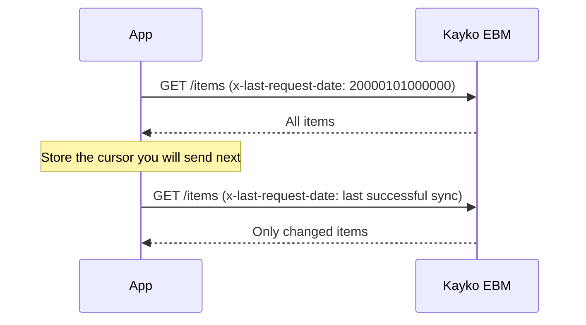

Many Kayko EBM **GET** routes are incremental, they only return records that changed since your last request.

## The `x-last-request-date` pattern

Send the cursor as a header (14 digits `YYYYMMDDHHmmss`), not in the JSON body. Do not send `lastReqDt` or `ebm_url`.

### Rules

1. **First sync:** Use `20000101000000` to fetch everything.
2. **Subsequent syncs:** Advance the cursor after a successful response.
3. **Store per endpoint:** Do not share one cursor across items, imports, purchases, and stocks.
4. **Store per branch:** Track the cursor per `x-tin` + `x-branch-id`.

### Endpoints that use `x-last-request-date`

| Endpoint | What it syncs |
|----------|---------------|
| `GET /codes` | Live RRA standard code classes from VSDC |
| `GET /item-classes` | Item classification tree |
| `GET /branches` | Branch office list |
| `GET /notices` | RRA announcements |
| `GET /items` | Registered products |
| `GET /imports` | Customs import declarations |
| `GET /purchases` | Supplier invoices to confirm |
| `GET /stocks` | Stock movement history |

Constants (`GET /constants/*`) are static tables and do not use this header. Tourism settings (`GET/PUT /codes/tourism`) are per-TIN Kayko configuration, not a VSDC delta cursor.

Mapped list responses use `{ message, data }`. An empty pull is `{ "message": "No … found", "data": [] }` (not an error). Upstream VSDC `resultCd: "001"` also means nothing new.

## Recommended sync schedule

| Data | Frequency | Priority |
|------|-----------|----------|
| Constants | Daily (or on app startup) | High, needed before transactions |
| Notices | Daily | Medium |
| Branches | Weekly | Low |
| Items | After each save + daily pull | High |
| Purchases | Every 15–30 minutes | High, for buyer confirmation |
| Imports | Every 15–30 minutes | High when you import |
| Stock movements | Daily | Medium |

## Offline considerations

Kayko EBM can issue receipts offline, but with a hard limit:

> If there is no internet connection for **24 hours** after a receipt signature is issued, the service **stops issuing receipt numbers**.

Plan your architecture accordingly:

- Queue sales locally when offline
- Sync as soon as connectivity returns
- Use `POST /sales/resend` if VSDC signed the sale but Kayko returned `EBM_SALE_PERSIST_FAILED`
