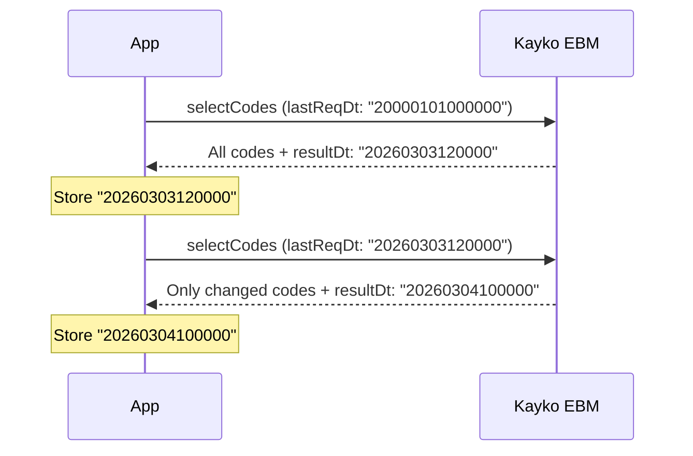

Many Kayko EBM endpoints are **incremental sync** APIs — they only return records that changed since your last request. Understanding this pattern is critical for a reliable integration.

## The `lastReqDt` pattern



### Rules

1. **First sync:** Use `"20000101000000"` or `"20210101010000"` to fetch everything.
2. **Subsequent syncs:** Use the `resultDt` from the previous successful response.
3. **Store per endpoint:** Each sync endpoint needs its own cursor. Don't share `lastReqDt` across different APIs.
4. **Store per branch:** If you operate multiple branches, track `lastReqDt` per `tin` + `bhfId` combination.

### Endpoints that use `lastReqDt`

| Endpoint | What it syncs |
|----------|---------------|
| `/code/selectCodes` | Tax types, payment methods, units, currencies |
| `/itemClass/selectItemsClass` | Item classification codes |
| `/branches/selectBranches` | Branch office list |
| `/notices/selectNotices` | RRA announcements |
| `/items/selectItems` | Registered products |
| `/imports/selectImportItems` | Customs import declarations |
| `/trnsPurchase/selectTrnsPurchaseSales` | Pending purchase invoices |
| `/stock/selectStockItems` | Stock movement history |

## Recommended sync schedule

| Data | Frequency | Priority |
|------|-----------|----------|
| Codes & classifications | Daily (or on app startup) | High- needed before transactions |
| Notices | Daily | Medium- RRA announcements |
| Branches | Weekly | Low- rarely changes |
| Items | After each save + daily pull | High |
| Purchases | Every 15–30 minutes | High- for buyer confirmation |
| Stock movements | Daily | Medium |

## Error handling during sync

```javascript
async function syncCodes(tin, bhfId, lastReqDt) {
  const response = await ebmPost('/code/selectCodes', { tin, bhfId, lastReqDt });

  if (response.resultCd === '000') {
    await saveCodes(response.data.clsList);
    await saveCursor('codes', response.resultDt); // only update on success
    return response.data;
  }

  if (response.resultCd === '001') {
    // No new data- this is fine, still update cursor
    await saveCursor('codes', response.resultDt);
    return [];
  }

  throw new EbmError(response.resultCd, response.resultMsg);
}
```

<Note>
  `resultCd: "001"` means "no search result"- it's not an error. It simply means nothing changed since your `lastReqDt`.
</Note>

## Offline considerations

Kayko EBM can issue receipts offline, but with a hard limit:

> If there is no internet connection for **24 hours** after a receipt signature is issued, the service **stops issuing receipt numbers**.

Plan your architecture accordingly:
- Queue sales locally when offline
- Sync as soon as connectivity returns
- Use `/trnsSales/resendSales` to re-submit failed transactions
