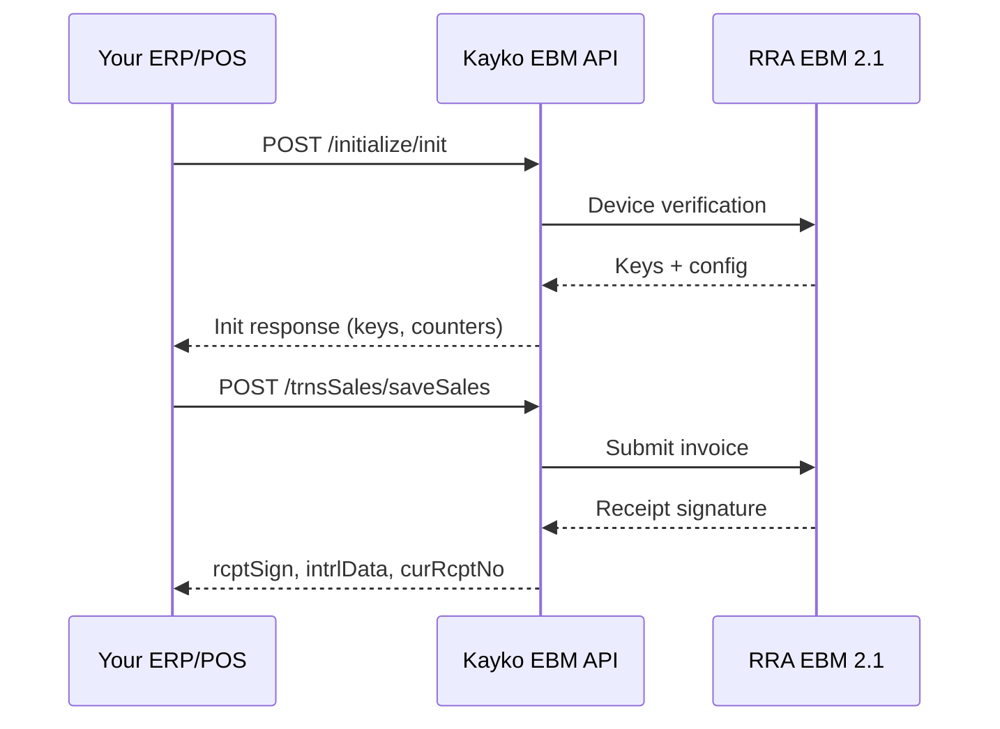

## The big picture

Kayko EBM sits between your business application and RRA's EBM 2.1 servers. Your app never talks to RRA directly — it calls the Kayko EBM API, which handles authentication, signing, and protocol translation.

## How you integrate

Third-party integrators use the **Kayko EBM gateway** only:

1. **Enable EBM** in the Kayko business dashboard
2. **Generate an API key** and send it on every request
3. Call gateway routes under your EBM base URL (for example `http://localhost:3000/ebm`)
4. Include `ebm_url` in the body when a route needs your business’s EBM endpoint (from Enable EBM)

Kayko manages hosting, updates, and connectivity to RRA on your behalf.

## Environments

| Type | Purpose | Notes |
|------|---------|-------|
| **Production** | Live invoicing | Real receipts, real tax obligations |
| **Test / Local EBM** | Development & certification | Local gateway or training-mode keys |

<Warning>
  Never use test credentials in production or vice versa. Receipt signatures from test environments have no legal validity.
</Warning>

## API design conventions

| Convention | Value |
|------------|-------|
| Protocol | HTTPS (HTTP for local dev) |
| Method | Mostly `POST`; constants use `GET` |
| Content-Type | `application/json` |
| Authentication | Kayko business API key on every request (`Authorization: Bearer sk_…` or `x-api-key`). Device signing keys come from initialization — see [API Keys](/concepts/api-keys) |
| Date format (datetime) | `yyyyMMddHHmmss` — e.g. `"20260303145619"` |
| Date format (date only) | `yyyyMMdd` — e.g. `"20260303"` |
| Branch `00` | Always means head office / headquarters |

## The 8 functional categories

| # | Category | Direction | Purpose |
|---|----------|-----------|---------|
| 1 | Initialization | Send | Enable EBM & one-time device auth |
| 2 | Reference Data | Pull | Codes, classifications, constants |
| 3 | Branch Info | Push | Customers, users, insurance |
| 4 | Items | Push & Pull | Product catalog |
| 5 | Imports | Pull & Push | Customs declarations |
| 6 | Sales | Push | Invoices + receipt signatures |
| 7 | Purchases | Pull & Push | Supplier invoice confirmation |
| 8 | Stock | Push | Inventory movements |

## Prerequisites checklist

Before integrating, ensure you have:

- [ ] RRA MyRRA membership
- [ ] EBM 2.1 service request approved
- [ ] Equipment registration completed (device serial number)
- [ ] EBM enabled in Kayko Settings and an API key generated
- [ ] TIN, branch ID, and device serial number
- [ ] Items registered in your catalog
