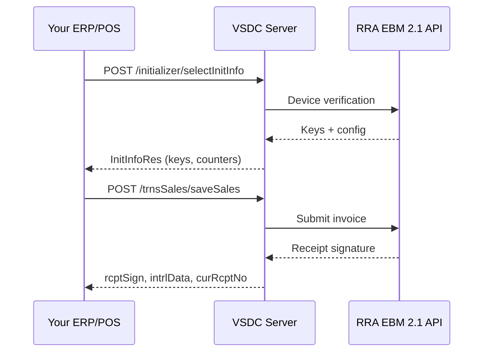

## The big picture

VSDC sits between your business application and RRA's EBM servers. Your app never talks to RRA directly- it talks to VSDC, which handles authentication, signing, and protocol translation.

## Deployment models

### Self-hosted (traditional)

RRA provides a **WAR file** you deploy on Tomcat, Jetty, or similar. Your application calls `http://localhost:8080/{endpoint}`.

**Pros:** Full control, works offline (with 24h receipt limit).  
**Cons:** You manage updates, SSL, uptime, and server maintenance.

### Kayko-hosted (managed)

Kayko runs VSDC for you at `https://vsdc.kayko.rw/rra-2.1.2.3.8`. Your app calls the hosted URL directly.

**Pros:** No server management, always up-to-date, production-ready.  
**Cons:** Requires internet connectivity.

## Environments

| Type | Purpose | Notes |
|------|---------|-------|
| **Production** | Live invoicing | Real receipts, real tax obligations |
| **Test** | Development & certification | Provided by RRA during VSDC approval |

<Warning>
  Never use test credentials in production or vice versa. Receipt signatures from test environments have no legal validity.
</Warning>

## API design conventions

| Convention | Value |
|------------|-------|
| Protocol | HTTPS (HTTP for local dev) |
| Method | `POST` for all endpoints |
| Content-Type | `application/json` |
| Authentication | Kayko business API key on every request (`Authorization: Bearer sk_…` or `x-api-key`). Device signing keys come from initialization- see [API Keys](/concepts/api-keys) |
| Date format (datetime) | `yyyyMMddHHmmss`- e.g. `"20260303145619"` |
| Date format (date only) | `yyyyMMdd`- e.g. `"20260303"` |
| Branch `00` | Always means head office / headquarters |

## The 8 functional categories

| # | Category | Direction | Purpose |
|---|----------|-----------|---------|
| 1 | Initialization | Send | One-time device auth |
| 2 | Reference Data | Pull | Codes, classifications, TINs, notices |
| 3 | Branch Info | Push | Customers, users, insurance |
| 4 | Items | Push & Pull | Product catalog |
| 5 | Imports | Pull & Push | Customs declarations |
| 6 | Sales | Push | Invoices + receipt signatures |
| 7 | Purchases | Pull & Push | Supplier invoice confirmation |
| 8 | Stock | Push | Inventory movements |

## Prerequisites checklist

Before integrating, ensure you have:

- [ ] RRA MyRRA membership
- [ ] EBM 2.1 service request approved
- [ ] Equipment registration completed
- [ ] VSDC WAR deployed (or Kayko-hosted access)
- [ ] EBM enabled in Kayko Settings and an API key generated
- [ ] TIN, branch ID, and device serial number
- [ ] Items registered in your catalog
