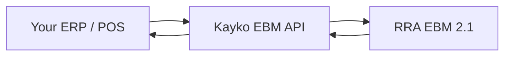

## What is Kayko EBM?

**Kayko EBM** is the API gateway between your CIS/ERP/POS application and **RRA EBM 2.1**. Your app talks only to Kayko — never to RRA directly. Kayko handles authentication, device signing, and protocol translation.



## Where to start

<Steps>
  <Step title="Authenticate">
    [API Keys](/concepts/api-keys) — enable EBM in the dashboard, generate a key, send it on every request.
  </Step>
  <Step title="Follow the checklist">
    [Integration Checklist](/workflows/getting-started) — recommended order of API calls from device init through sales, purchases, and stock.
  </Step>
  <Step title="Build your first flow">
    Pick the API page that matches what you're building — [Sales](/api/sales), [Purchases](/api/purchases), or [Stock](/api/stock). Each page includes the workflow, field reference, and code examples.
  </Step>
  <Step title="Try it live">
    Switch to the **API Playground** tab to send test requests against any endpoint.
  </Step>
</Steps>

## Base URL

Code samples use `{{baseUrl}}`. On playground pages, pick the server from the **environment dropdown** (default: `http://localhost:3000/ebm`).

Routes that proxy to your business EBM instance also need `ebm_url` in the JSON body (assigned when you enable EBM), for example `http://localhost:8080/rra/{business_code}/`.

<Warning>
  If the EBM service loses internet connectivity for **24 hours** after issuing a receipt signature, it stops issuing new receipt numbers. Plan for offline resilience in your integration.
</Warning>

## Standard response

Every transactional endpoint returns the same envelope:

```json
{
  "resultCd": "000",
  "resultMsg": "It is succeeded",
  "resultDt": "20260303145619",
  "data": { }
}
```

| Field | Meaning |
|-------|---------|
| `resultCd` | `"000"` = success. Anything else → [Response Codes](/reference/response-codes). |
| `resultMsg` | Human-readable message |
| `resultDt` | Server timestamp (`yyyyMMddHHmmss`) |
| `data` | Payload — shape varies per endpoint |

Some Kayko routes (for example `/customers/*`) return unwrapped `data`. Auth failures use `{ statusCode, message, errorCode }`.

## Common request fields

Almost every request includes:

| Field | Example | Notes |
|-------|---------|-------|
| `tin` | `"100027060"` | Your 9-digit RRA TIN |
| `bhfId` | `"00"` | `"00"` = head office, `"01"`–`"99"` = branches |
| `lastReqDt` | `"20250101010000"` | Sync endpoints only — returns records modified after this timestamp |

Kayko EBM may accept snake_case aliases (for example `branch_id`). Date formats: `yyyyMMddHHmmss` for datetimes, `yyyyMMdd` for dates.

## Conventions

| Convention | Value |
|------------|-------|
| Protocol | HTTPS (HTTP for local dev) |
| Method | Mostly `POST`; constants use `GET` |
| Content-Type | `application/json` |
| Authentication | `Authorization: Bearer sk_…` or `x-api-key` on every request |
