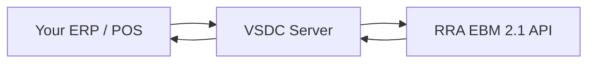

<Note>
  Official API documentation for the **RRA VSDC** integration (v1.0.5), published by **[Kayko](/contributions/overview)**. Includes field references, workflow guides, calculation formulas, and an [API Playground](/playground/overview) for live testing.
</Note>

## What is VSDC?

**VSDC** (Virtual Sales Data Controller) is a bridge between your CIS/ERP application and the **RRA EBM 2.1 API server**. It handles:

- Device authentication and cryptographic keys
- Synchronizing reference codes (tax types, units, currencies, etc.)
- Registering items, customers, and branch data
- Submitting sales invoices and receiving receipt signatures
- Confirming purchases and managing stock movements



## Authentication (Kayko)

Kayko integrations authenticate with a **business API key**, not a per-request password or JWT.

1. Open your **Kayko business dashboard**
2. Go to **Settings → Enable EBM**
3. **Generate an API key**
4. Call the Kayko EBM gateway (`/ebm/…`) with `Authorization: Bearer sk_…` or `x-api-key: sk_…` — see [Base URLs](#base-urls) for your environment

Full details: [API Keys & Authentication](/concepts/api-keys).

## Documentation overview

See the full [Table of Contents](/table-of-contents) for every page organized by section.

| Section | Contents |
|---------|----------|
| [API Keys](/concepts/api-keys) | Enable EBM, generate a key, authenticate requests |
| [Glossary](/glossary) | Field acronyms and definitions |
| [Workflows](/workflows/getting-started) | Step-by-step sales, purchase, and stock flows |
| [Calculations](/calculations/overview) | VAT formulas, discounts, and invoice totals |
| [API Reference](/api/overview) | Full endpoint structure by domain |
| [Reference Tables](/reference/field-reference) | Field specs, enumerations, and code tables |
| [API Playground](/playground/overview) | Live endpoint testing |

## API at a glance

Kayko EBM (`/ebm`) is live for initialization, customers, and constants. The full domain structure below remains documented.

| Category | Endpoints | Direction |
|----------|-----------|-----------|
| [Initialization](/api/initialization) | `/initialize/*` + `selectInitInfo` | Device setup |
| [Reference Data](/api/reference-data) | Codes, notices, classifications, `GET /constants/*` | Pull / local tables |
| [Branches & Customers](/api/branches-customers) | `/customers/*` + branch saves | Push & lookup |
| [Items](/api/items) | 3 | Push & pull product catalog |
| [Imports](/api/imports) | 2 | Customs import declarations |
| [Sales](/api/sales) | 2 | Push invoices, get signatures |
| [Purchases](/api/purchases) | 2 | Pull & confirm supplier invoices |
| [Stock](/api/stock) | 3 | Inventory in/out & master |

## Base URLs

Pick an **API Environment** from the navbar dropdown. Code samples use `{{baseUrl}}` and update when you switch:

| Environment | When to use |
|-------------|-------------|
| **Local EBM** | Kayko EBM gateway (preferred for live EBM routes) |
| **Production VSDC** | Direct hosted VSDC |
| **Local VSDC** | Self-hosted WAR |
| **Business `ebm_url`** | Body field for Kayko EBM routes (from Enable EBM), e.g. `…/rra/{business_code}/` |

<Warning>
  If VSDC loses internet connectivity for **24 hours** after issuing a receipt signature, it stops issuing new receipt numbers. Plan for offline resilience in your integration.
</Warning>

## Standard response envelope

Every API returns the same top-level structure:

```json
{
  "resultCd": "000",
  "resultMsg": "It is succeeded",
  "resultDt": "20260303145619",
  "data": { }
}
```

| Field | Meaning |
|-------|---------|
| `resultCd` | Status code- `000` means success. See [Response Codes](/reference/response-codes). |
| `resultMsg` | Human-readable message |
| `resultDt` | Server timestamp (`yyyyMMddHHmmss`) |
| `data` | Payload- shape varies per endpoint. `null` on save operations. |

## Common request fields

Almost every request includes these three fields:

| Field | Full Name | Example | Notes |
|-------|-----------|---------|-------|
| `tin` | Taxpayer Identification Number | `"100027060"` | Your 9-digit RRA TIN |
| `bhfId` | Branch ID | `"00"` | `"00"` = head office, `"01"`–`"99"` = branches |
| `lastReqDt` | Last Request Date | `"20250101010000"` | For sync endpoints- only returns records modified after this timestamp |

## Next steps

<CardGroup cols={2}>
  <Card title="Table of Contents" icon="list-tree" href="/table-of-contents">
    Full documentation map and suggested learning path.
  </Card>
  <Card title="Quickstart" icon="bolt" href="/quickstart">
    Enable EBM, generate an API key, initialize your device, and make your first call.
  </Card>
  <Card title="API Keys" icon="key" href="/concepts/api-keys">
    How dashboard enablement and request authentication work.
  </Card>
  <Card title="Glossary" icon="book" href="/glossary">
    Decode every acronym before you write a single line of code.
  </Card>
  <Card title="Sales Workflow" icon="receipt" href="/workflows/sales-invoice">
    End-to-end guide to issuing a compliant EBM invoice.
  </Card>
  <Card title="API Reference" icon="code" href="/api/overview">
    Full endpoint documentation with multi-language examples.
  </Card>
  <Card title="Calculations" icon="calculator" href="/calculations/overview">
    VAT formulas, line items, discounts, and invoice totals explained.
  </Card>
  <Card title="Contributions" icon="users" href="/contributions/overview">
    Publisher and contributors.
  </Card>
</CardGroup>
