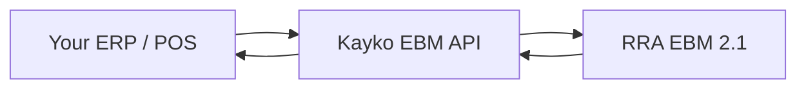

## What is Kayko EBM?

**Kayko EBM** is the API gateway between your CIS/ERP/POS application and **RRA EBM 2.1**. Your app talks only to Kayko, never to RRA directly. Kayko handles authentication, device signing, and protocol translation.



## Where to start

<Steps>
  <Step title="Authenticate">
    [API Keys](/concepts/api-keys): enable EBM in the dashboard, generate a key, and send it on every request.
  </Step>
  <Step title="Follow the checklist">
    [Integration Checklist](/workflows/getting-started): recommended order of API calls from device init through sales, purchases, and stock.
  </Step>
  <Step title="Build your first flow">
    Pick the API page that matches what you're building: [Sales](/api/sales), [Purchases](/api/purchases), or [Stock](/api/stock). Each page includes the workflow, field reference, and code examples.
  </Step>
  <Step title="Try it live">
    Switch to the **API Playground** tab to send test requests against any endpoint.
  </Step>
</Steps>

## Base URL

Code samples use `{{baseUrl}}`. On playground pages, pick the server from the **environment dropdown** (default: `http://localhost:3000/ebm`).

Proxied business routes need tenant headers (not `ebm_url` in the body):

| Header | Rule |
|--------|------|
| `x-tin` | Your 9-digit TIN |
| `x-branch-id` | 2-character branch ID (`00` = head office) |
| `x-last-request-date` | 14 digits `YYYYMMDDHHmmss` on `GET /branches`, `GET /notices`, `GET /items`, `GET /imports`, `GET /purchases`, and `GET /stocks` |

Kayko resolves your business `ebm_url` from Core360 after you Enable EBM. You do not send it on later calls.

Item create/update/deactivate, import confirm, and purchase confirm must use head office `x-branch-id: 00`.

<Warning>
  If the EBM service loses internet connectivity for **24 hours** after issuing a receipt signature, it stops issuing new receipt numbers. Plan for offline resilience in your integration.
</Warning>

## Standard response

Many transactional upstream calls use this envelope:

```json
{
  "resultCd": "000",
  "resultMsg": "It is succeeded",
  "resultDt": "20260303145619",
  "data": { }
}
```

| Field | Meaning |
|-------|---------|
| `resultCd` | `"000"` = success. Anything else → [Response Codes](/reference/response-codes). |
| `resultMsg` | Human-readable message |
| `resultDt` | Server timestamp (`yyyyMMddHHmmss`) |
| `data` | Payload; shape varies per endpoint |

Some Kayko routes return unwrapped `data`, or a mapped `{ message, data }` list (for example constants and notices). Auth failures use `{ status, message, error }`.

## Conventions

| Convention | Value |
|------------|-------|
| Protocol | HTTPS (HTTP for local dev) |
| Method | Mix of `GET`, `POST`, `PUT`, `DELETE` (lists are `GET`) |
| Content-Type | `application/json` |
| Authentication | `Authorization: Bearer sk_…` or `x-api-key` on business routes |
