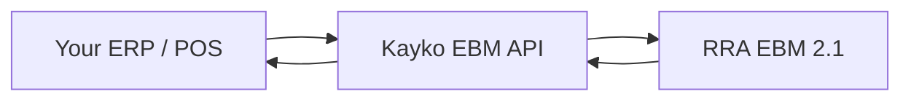

<Note>
  Official API documentation for the **Kayko EBM** integration, published by **[Kayko](/contributions/overview)**. Includes field references, workflow guides, calculation formulas, and an [API Playground](/playground/overview) for live testing.
</Note>

## What is Kayko EBM?

**Kayko EBM** is the API gateway between your CIS/ERP/POS application and the **RRA EBM 2.1** tax infrastructure. Your app talks only to Kayko EBM. It handles:

- Business authentication via API keys
- Device initialization and cryptographic keys
- Synchronizing reference codes (tax types, units, currencies, and more)
- Registering items, customers, and branch data
- Submitting sales invoices and receiving receipt signatures
- Confirming purchases and managing stock movements



## Documentation overview

See the full [Table of Contents](/table-of-contents) for every page organized by section.

| Section | Contents |
|---------|----------|
| [API Keys](/concepts/api-keys) | Enable EBM, generate a key, authenticate requests |
| [Workflows](/workflows/getting-started) | Step-by-step sales, purchase, and stock flows |
| [Calculations](/calculations/overview) | VAT formulas, discounts, and invoice totals |
| [API Reference](/api/overview) | Full endpoint structure by domain |
| [Reference Tables](/reference/field-reference) | Field specs, enumerations, and code tables |
| [API Playground](/playground/overview) | Live endpoint testing |

## API at a glance

All endpoints use **REST over HTTPS** with **JSON** bodies. Most transactional routes are `POST`; reference constants are `GET`.

| Category | Endpoints | Direction |
|----------|-----------|-----------|
| [Initialization](/api/initialization) | `/initialize/*` | Enable EBM & device setup |
| [Reference Data](/api/reference-data) | `GET /constants/*` | Pull codes and lookup tables |
| [Branches & Customers](/api/branches-customers) | `/customers/*` + branch saves | Push & lookup |
| [Items](/api/items) | Item register / select / composition | Push & pull catalog |
| [Imports](/api/imports) | Import select & update | Customs declarations |
| [Sales](/api/sales) | Save & resend sales | Push invoices, get signatures |
| [Purchases](/api/purchases) | Select & save purchases | Pull & confirm supplier invoices |
| [Stock](/api/stock) | Stock in/out & master | Inventory movements |

## Base URL

Pick an **API Environment** from the navbar dropdown. Code samples use `{{baseUrl}}` and update when you switch:

| Environment | When to use |
|-------------|-------------|
| **Local EBM** | Kayko EBM gateway (`http://localhost:3000/ebm`) for development |

Kayko EBM routes that proxy per-business operations also require `ebm_url` in the JSON body (assigned when you Enable EBM), for example `http://localhost:8080/rra/{business_code}/`.

<Warning>
  If the EBM service loses internet connectivity for **24 hours** after issuing a receipt signature, it stops issuing new receipt numbers. Plan for offline resilience in your integration.
</Warning>

## Standard response envelope

Transactional endpoints return the same top-level structure:

```json
{
  "resultCd": "000",
  "resultMsg": "It is succeeded",
  "resultDt": "20260303145619",
  "data": { }
}
```

| Field | Meaning |
|-------|---------|
| `resultCd` | Status code — `000` means success. See [Response Codes](/reference/response-codes). |
| `resultMsg` | Human-readable message |
| `resultDt` | Server timestamp (`yyyyMMddHHmmss`) |
| `data` | Payload — shape varies per endpoint. `null` on many save operations. |

Some Kayko EBM routes (for example `/customers/*`) return unwrapped `data`. Auth failures use Kayko’s `{ statusCode, message, errorCode }` shape.

## Common request fields

Almost every request includes these three fields (Kayko EBM may accept snake_case aliases such as `branch_id`):

| Field | Full Name | Example | Notes |
|-------|-----------|---------|-------|
| `tin` | Taxpayer Identification Number | `"100027060"` | Your 9-digit RRA TIN |
| `bhfId` | Branch ID | `"00"` | `"00"` = head office, `"01"`–`"99"` = branches |
| `lastReqDt` | Last Request Date | `"20250101010000"` | For sync endpoints — only returns records modified after this timestamp |

## Next steps

<CardGroup cols={2}>
  <Card title="Table of Contents" icon="list-tree" href="/table-of-contents">
    Full documentation map and suggested learning path.
  </Card>
  <Card title="Quickstart" icon="bolt" href="/quickstart">
    Enable EBM, generate an API key, and make your first call.
  </Card>
  <Card title="API Keys" icon="key" href="/concepts/api-keys">
    How dashboard enablement and request authentication work.
  </Card>
  <Card title="Sales Workflow" icon="receipt" href="/workflows/sales-invoice">
    End-to-end guide to issuing a compliant EBM invoice.
  </Card>
  <Card title="API Reference" icon="code" href="/api/overview">
    Full endpoint documentation with multi-language examples.
  </Card>
  <Card title="Calculations" icon="calculator" href="/calculations/overview">
    VAT formulas, line items, discounts, and invoice totals explained.
  </Card>
  <Card title="Contributions" icon="users" href="/contributions/overview">
    Publisher and contributors.
  </Card>
</CardGroup>
