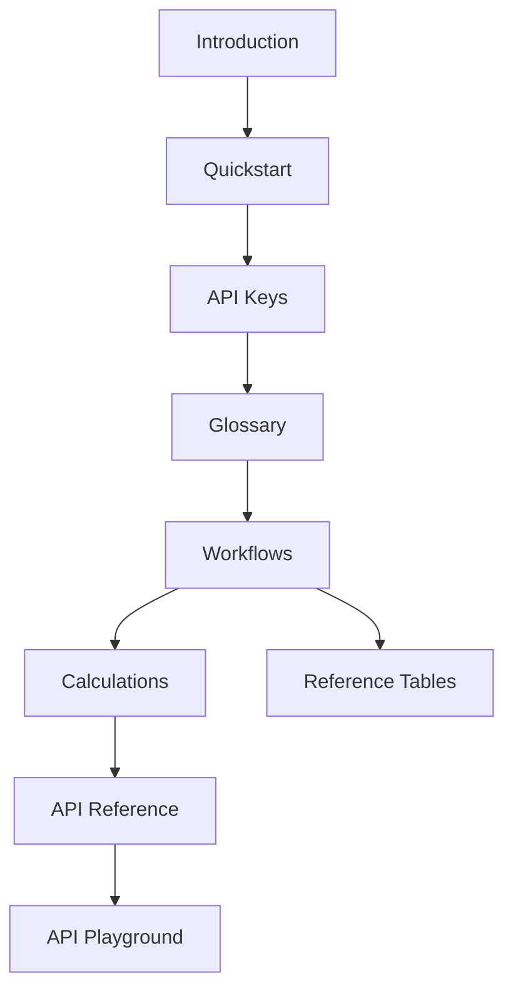

Use this page as your roadmap. Sections follow a logical learning path from setup through live API testing.

<Card title="New here?" icon="bolt" href="/quickstart">
  Start with [Quickstart](/quickstart) if you want to initialize your device and make a first API call immediately.
</Card>

---

## Getting Started

| Page | What you'll learn |
|------|-------------------|
| [Introduction](/introduction) | What VSDC is, API keys, base URLs, response envelope |
| [Quickstart](/quickstart) | Enable EBM, generate a key, initialize device, sync codes, register an item |
| [Glossary](/glossary) | Every field acronym decoded |

## Core Concepts

| Page | What you'll learn |
|------|-------------------|
| [VSDC Overview](/concepts/vsdc-overview) | Architecture and deployment models |
| [API Keys & Authentication](/concepts/api-keys) | Enable EBM in the dashboard and authenticate every request |
| [Onboarding & Policies](/concepts/onboarding) | RRA registration and technical requirements |
| [Data Synchronization](/concepts/data-sync) | How `lastReqDt` incremental sync works |

## Workflows

| Page | What you'll learn |
|------|-------------------|
| [Getting Started](/workflows/getting-started) | Recommended order of API calls |
| [Sales Invoice](/workflows/sales-invoice) | Issue a compliant EBM invoice |
| [Purchases](/workflows/purchases) | Pull and confirm supplier invoices |
| [Stock Management](/workflows/stock-management) | Stock in/out and master updates |

## Calculations

| Page | What you'll learn |
|------|-------------------|
| [Overview](/calculations/overview) | Calculation layers and golden rules |
| [VAT Formulas](/calculations/vat-formulas) | 18/118 extraction, tax categories A–D |
| [Line Items](/calculations/line-items) | `prc`, `qty`, `splyAmt`, per-line totals |
| [Discounts](/calculations/discounts) | `dcRt`, `dcAmt`, post-discount VAT |
| [Invoice Totals](/calculations/invoice-totals) | Header aggregation and consistency checks |
| [Stock & Purchases](/calculations/stock-and-purchases) | Movement and confirmation amounts |

## API Reference

| Page | Endpoints |
|------|-----------|
| [Overview](/api/overview) | All endpoints at a glance |
| [Initialization](/api/initialization) | `/initialize/*` |
| [Reference Data](/api/reference-data) | `GET /constants/…` (Select Countries, Taxes, …) |
| [Branches & Customers](/api/branches-customers) | `/customers/*`, users, insurance |
| [Items](/api/items) | Item registration, `itemCd` format, composition |
| [Imports](/api/imports) | Customs import declarations |
| [Sales](/api/sales) | Invoices and receipt signatures |
| [Purchases](/api/purchases) | Supplier invoice pull and confirm |
| [Stock](/api/stock) | Movements and stock master |

## Reference Tables

| Page | Contents |
|------|----------|
| [Field Reference](/reference/field-reference) | Every request/response field |
| [Response Codes](/reference/response-codes) | `resultCd` values and fixes |
| [Enumerations](/reference/enumerations) | Tax types, payment methods, stock types |
| [Country Codes](/reference/country-codes) | 252 nation codes |
| [Currency Codes](/reference/currency-codes) | 179 currency codes |
| [Changelog](/reference/changelog) | Specification revision history |

## API Playground

| Page | Contents |
|------|----------|
| [Playground Guide](/playground/overview) | Environments, auth, groups, response shapes |
| **Initialization** | Enable EBM, status, Initialize Device |
| **Reference Data** | Select Countries, Taxes, Packaging, … (`GET /constants/…`) |
| **Branches & Customers** | Select Customer, Create Branch Customer, branch saves |
| **Items** | Register, pull, and compose items |
| **Imports** | Customs import declarations |
| **Sales** | Invoices and resend |
| **Purchases** | Pull and confirm purchases |
| **Stock** | Movements and stock master |

## Contributors

| Page | Contents |
|------|----------|
| [Contributors](/contributions/overview) | Publisher and documentation authors |

---

## Suggested learning path

<Steps>
  <Step title="Understand the system">
    Read [Introduction](/introduction) and [VSDC Overview](/concepts/vsdc-overview).
  </Step>
  <Step title="Authenticate">
    Follow [API Keys](/concepts/api-keys): Settings → Enable EBM → generate a key.
  </Step>
  <Step title="Connect your device">
    Follow [Quickstart](/quickstart) and [Onboarding](/concepts/onboarding).
  </Step>
  <Step title="Learn the flows">
    Work through [Workflows](/workflows/getting-started)- sales first.
  </Step>
  <Step title="Get the math right">
    Study [Calculations](/calculations/overview) before going to production.
  </Step>
  <Step title="Build and test">
    Use [API Reference](/api/overview) and the [API Playground](/playground/overview).
  </Step>
</Steps>
