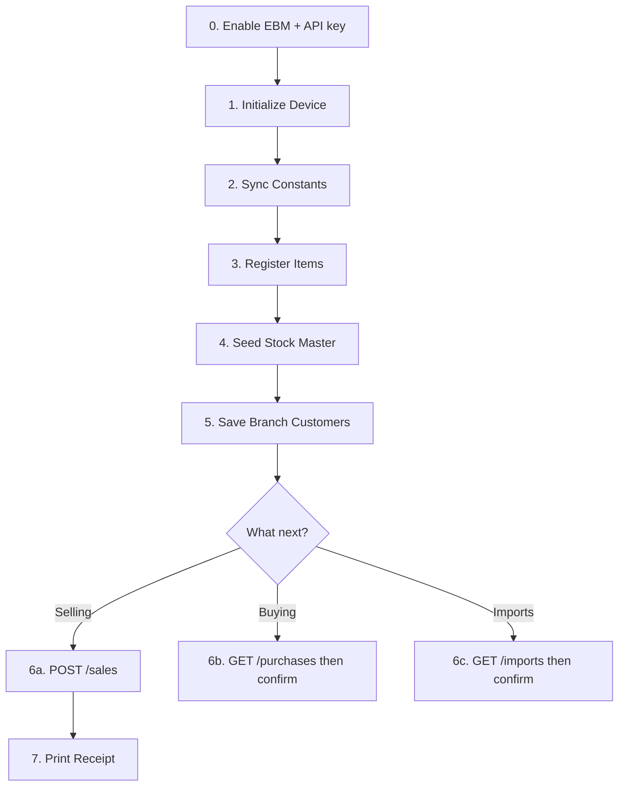

## Prerequisites

Before you start integrating, ensure you have:

- RRA MyRRA membership and EBM 2.1 service request approved
- Equipment registration completed (device serial number)
- EBM enabled in Kayko Settings and an API key generated
- TIN, branch ID, and device serial number on hand

For regulatory requirements, see [Onboarding & Policies](/concepts/onboarding).

## Step-by-step

### 0. Enable EBM and generate an API key

In the Kayko business dashboard: **Settings → Enable EBM → Generate API key**. Send `Authorization: Bearer sk_…` (or `x-api-key`) on every call below. See [API Keys & Authentication](/concepts/api-keys).

### 1. Initialize device (once)

`POST /initialize/init`

Send `x-tin`, `x-branch-id`, and a body with `device_serial_number` plus `business_code`. Authenticate with `X-API-Token` or your API key. See [Initialization API](/api/initialization).

### 2. Sync reference codes

Use `GET /constants/*` (taxes, payment modes, packaging, quantity, stock types, refund reasons) and cache the results. See [Constants](/api/constants).

### 3. Register your products

`POST /items` with `x-branch-id: 00`. Omit `item_code` to let Kayko allocate it. See [Items](/api/items#item-code-format).

### 4. Seed remaining quantity

`POST /stocks/master` for each stocked item (`remaining_quantity` is absolute on-hand). Automatic stock after sales/purchases/imports only updates the ledger when a master row exists. Skip services (`item_type` `3`).

### 5. Set up branch data (optional but recommended)

| Endpoint | Purpose |
|----------|---------|
| `GET /customers` | Look up a customer by TIN |
| `POST /customers/create` | Back up customer list |
| `POST /branches/users` | Register branch user accounts |
| `POST /branches/insurances` | Insurance providers (pharmacy only) |
| `GET /branches` | Incremental branch list (`x-last-request-date`) |
| `GET /notices` | RRA notices (`x-last-request-date`) |

### 6. Start transacting

| Workflow | Routes |
|----------|--------|
| Selling | `POST /sales` — then print `print.receipt_signature`. Refunds: `POST /sales/refund`. |
| Buying | `GET /purchases` then `POST /purchases/confirm` (`x-branch-id: 00`) |
| Imports | `GET /imports` then `POST /imports/confirm` (`x-branch-id: 00`) |
| Manual stock | `POST /stocks` for adjustments only |

Do **not** POST stock in the same request as a sale or confirm. Kayko queues stock after VSDC `000`.

## Dependency rules

<Warning>
  These ordering constraints are enforced for compliance:
</Warning>

| Rule | Why |
|------|-----|
| Enable EBM and create an API key first | Kayko rejects unauthenticated requests |
| Initialize before anything else | Device must be authenticated with RRA |
| Register items before selling them | Unknown `item_code` → `EBM_ITEM_NOT_REGISTERED` |
| Item writes, import confirm, purchase confirm at branch `00` | Other branches → `EBM_HEAD_OFFICE_REQUIRED` |
| Seed stock master before selling stocked goods | Auto movements update remaining qty only if the ledger is seeded |
| Pull purchases/imports before confirming | Confirm uses data from the list response |
| Normal sale `orgInvcNo` is `0` | Kayko sets this; do not send `original_invoice_no` equal to `invoice_no` |

## Ongoing operations

After initial setup, your daily loop looks like:

1. **Sync constants** (if the app was offline)
2. **Check notices** for RRA announcements
3. **Process sales** as they happen (`POST /sales`)
4. **Pull and confirm purchases/imports** periodically (head office)
5. **Let Kayko post stock** after `000`; use `GET /stocks` to inspect movements
