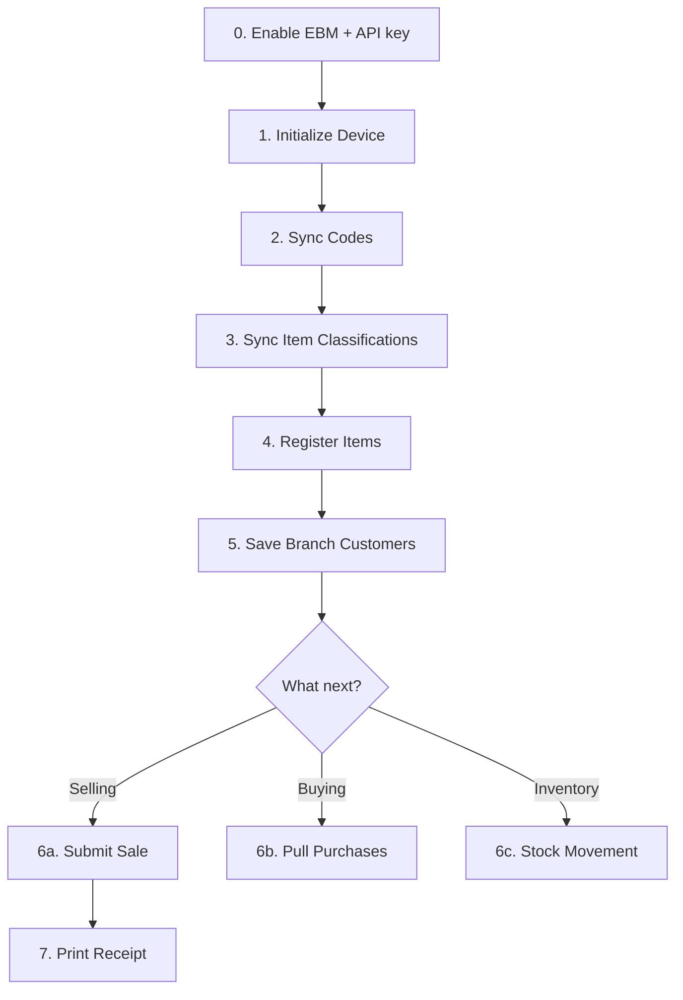

## Step-by-step

### 0. Enable EBM and generate an API key

In the Kayko business dashboard: **Settings → Enable EBM → Generate API key**. Send `Authorization: Bearer sk_…` (or `x-api-key`) on every call below. See [API Keys & Authentication](/concepts/api-keys).

### 1. Initialize device (once)

`POST /initializer/selectInitInfo`

Authenticate your device and retrieve signing keys. See [Initialization API](/api/initialization).

### 2. Sync reference codes

`POST /code/selectCodes`

Pull tax types, payment methods, packaging units, quantity units, currencies, and more. Cache these locally- your UI dropdowns depend on them.

### 3. Sync item classifications

`POST /itemClass/selectItemsClass`

Get the RRA product category tree. You need a valid `itemClsCd` before registering items.

### 4. Register your products

`POST /items/saveItems`

Register each product with a unique `itemCd`. See [Items API- item code format](/api/items#item-code-format).

### 5. Set up branch data (optional but recommended)

| Endpoint | Purpose |
|----------|---------|
| `/branches/saveBrancheCustomers` | Back up customer list to RRA |
| `/branches/saveBrancheUsers` | Register branch user accounts |
| `/branches/saveBrancheInsurances` | Insurance providers (pharmacy only) |

### 6. Start transacting

Pick your workflow:

- **Selling goods?** → [Sales Invoice Workflow](/workflows/sales-invoice)
- **Confirming supplier invoices?** → [Purchases Workflow](/workflows/purchases)
- **Managing inventory?** → [Stock Management Workflow](/workflows/stock-management)

## Dependency rules

<Warning>
  These ordering constraints are enforced by RRA:
</Warning>

| Rule | Why |
|------|-----|
| Enable EBM and create an API key first | Kayko rejects unauthenticated requests |
| Initialize before anything else | Device must be authenticated with RRA |
| Register items before selling them | `itemCd` must exist on the server |
| Submit sale before stock-out | Stock movements reference invoice data |
| Stock in/out before stock master update | Master reflects movement results |
| Pull purchases before confirming them | You can only confirm invoices that exist |

## Ongoing operations

After initial setup, your daily loop looks like:

1. **Sync codes** (if app was offline)
2. **Check notices** for RRA announcements
3. **Process sales** as they happen
4. **Pull & confirm purchases** periodically
5. **Adjust stock** after sales/purchases
