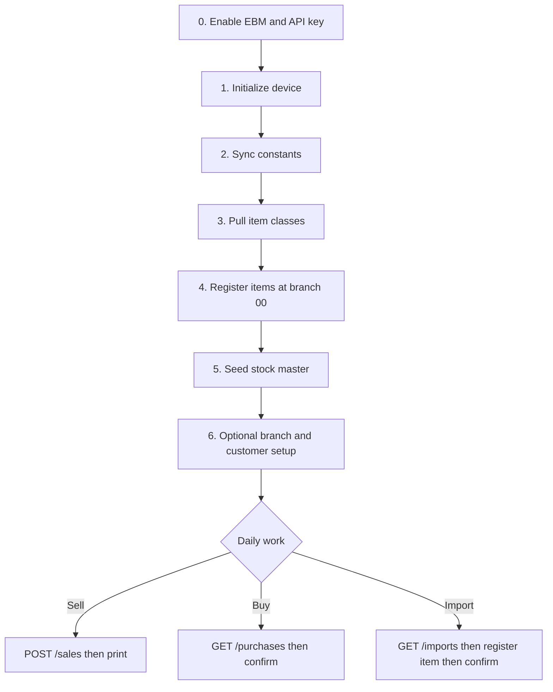

This checklist is the practical path from a newly approved EBM taxpayer to daily fiscal transactions. It assumes you have never operated VSDC before. Formal definitions live in the [Glossary](/reference/glossary).

## Prerequisites

Before the first API call, confirm you have:

- MyRRA membership and an approved EBM 2.1 / VSDC service request
- Equipment registration completed and a device serial number from RRA
- EBM enabled for the business in Kayko and a business API key generated
- The nine-character TIN, two-character branch IDs (including head office `00`), and device serial number on hand

Regulatory context: [Onboarding & Policies](/concepts/onboarding). Authentication details: [API Keys](/concepts/api-keys).

## Step-by-step

### 0. Enable EBM and generate an API key

In the Kayko business dashboard open **Settings → Enable EBM → Generate API key**. Send `Authorization: Bearer sk_…` (or `x-api-key`) on business routes. Initialization routes also accept the internal token when your operator uses that path.

### 1. Initialize the device (once)

Call [`POST /initialize/init`](/api/initialization) with `x-tin`, `x-branch-id`, `device_serial_number`, and `business_code`. This is the Kayko wrapper around VSDC `initializer/selectInitInfo`. Do not re-initialize unless RRA instructs you to. After success, Kayko continues to resolve `ebm_url` from the business record, you never send that URL on later calls.

### 2. Sync reference data

Pull Kayko’s friendly tables with [`GET /constants/*`](/api/constants) (taxes, payment modes, packaging, quantity units, stock types, refund reasons, and related lists).

If your business is tourism-tax related, or a non-tourism TIN still fails sales with tourism-rate errors, pass `tourism_tax`, `tax_rate_f`, and `tax_rate_tt` on [`POST /sales`](/api/sales) only after you know which rates the device accepts. Until RRA confirms device-specific values, treat those numbers as **unconfirmed**.

### 3. Pull item classification codes

Call [`GET /item-classes`](/api/items#item-classes) with `x-last-request-date`. You need a ten-digit `item_classification_code` when registering products.

### 4. Register products at head office

Create catalog rows with [`POST /items`](/api/items) using **`x-branch-id: 00`**. Send `item_type` as a text label: `raw_material`, `finished_product`, or `service` (legacy codes `1` / `2` / `3` still work). Omit `item_code` to let Kayko allocate the next code for the origin/type/units prefix. Composition links use [`POST /items/compositions`](/api/items#compositions), one parent/component pair per request.

### 5. Seed stock master for stocked goods

For each physical item, call [`POST /stocks/master`](/api/stock) with the absolute `remaining_quantity` on hand. Automatic movements after sales, purchase confirms, and import confirms only update remaining quantity when a master row exists. Skip services.

### 6. Optional branch and customer setup

| Goal | Endpoint |
|------|----------|
| Look up a taxpayer by TIN | `GET /customers` |
| Store a branch customer backup | `POST /customers/create` |
| Register branch user accounts | `POST /branches/users` |
| Register pharmacy insurers | `POST /branches/insurances` |
| Sync branch list | `GET /branches` with `x-last-request-date` |
| Read RRA notices | `GET /notices` with `x-last-request-date` |

## Cross-module flows (in words)

### Selling goods

1. Ensure the product exists (`POST /items` / `GET /items`) and stock master is seeded if the item is stocked.
2. Submit [`POST /sales`](/api/sales) with nested `customer`, `purchase_code` when selling to a business TIN, and line items that use registered `item_code` values.
3. On success, print `print.receipt_signature` and `print.internal_data`.
4. Kayko enqueues stock-out after VSDC `000`. Do not post a duplicate stock-out in the same user action unless you are doing a **manual** adjustment via `POST /stocks`.

### Confirming a supplier purchase

1. Poll [`GET /purchases`](/api/purchases) with `x-last-request-date` so Kayko can return supplier invoices waiting for your confirmation.
2. Ensure every purchase line’s `item_code` is already registered; register missing products at branch `00` first.
3. Confirm at head office with [`POST /purchases/confirm`](/api/purchases) (`x-branch-id: 00`), including nested `supplier` and `dates` when required by your payload.
4. After success, Kayko queues stock-in. You do not confirm and post stock in one client round-trip.

### Clearing a customs import

1. Poll [`GET /imports`](/api/imports) for declaration lines (quantities and weights come from this list).
2. Register a matching product with [`POST /items`](/api/items) if it does not exist yet, confirm requires an `item_code` that VSDC already knows.
3. Confirm at head office with [`POST /imports/confirm`](/api/imports) (`status` approved or cancelled). Confirm bodies do not carry quantity; stock-in uses the quantity from the list response when the line is approved.
4. Kayko posts import stock asynchronously after approval.

These three flows all share the same rule from the VSDC business process tables: **items before movements**, and **sales/purchase/import documents before (or triggering) stock**, never the other way around.

## Dependency rules

| Rule | Why |
|------|-----|
| Enable EBM and create an API key first | Unauthenticated calls are rejected |
| Initialize before transactional traffic | The device must be authenticated with RRA |
| Sync constants before building UI dropdowns | Prevents invalid packaging, tax, and payment codes |
| Register items before selling, confirming purchases, or confirming imports | Unknown `item_code` → `EBM_ITEM_NOT_REGISTERED` |
| Item writes, import confirm, and purchase confirm at branch `00` | Other branches → `EBM_HEAD_OFFICE_REQUIRED` |
| Seed stock master before selling stocked goods | Auto movements need a ledger row |
| Normal sale original invoice is `0` | Kayko sets this; do not mirror `invoice_no` into `original_invoice_no` |
| Do not POST stock in the same request as sale/confirm | Kayko queues stock after VSDC success |

## Ongoing operations

1. Refresh constants and notices on a schedule (and after long offline periods).
2. Advance each endpoint’s `x-last-request-date` cursor independently after successful pulls ([Data Synchronization](/concepts/data-sync)).
3. Process sales as they happen; use `POST /sales/refund` for refunds and `POST /sales/resend` only when a signature must be replayed.
4. Keep polling purchases and imports during business hours if you buy or import regularly.
5. Remember the **24-hour offline** fiscal signing limit described in the introduction and onboarding docs.
