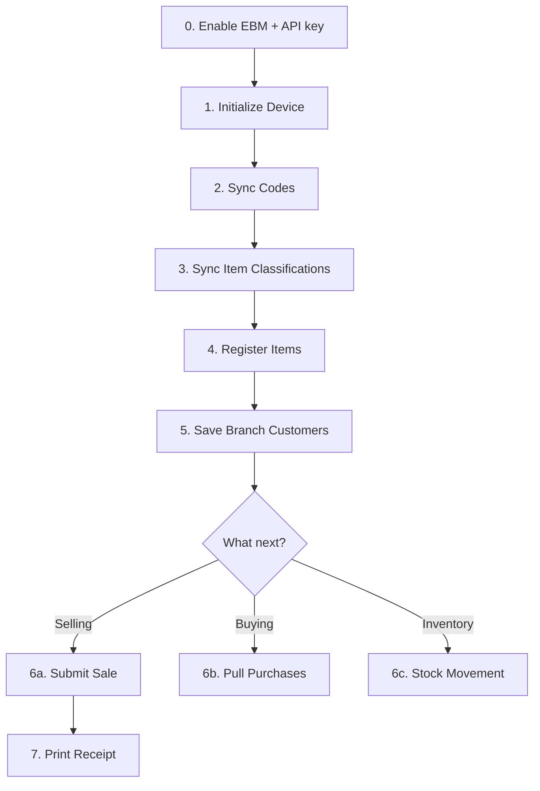

## Prerequisites

Before you start integrating, ensure you have:

- RRA MyRRA membership and EBM 2.1 service request approved
- Equipment registration completed (device serial number)
- EBM enabled in Kayko Settings and an API key generated
- TIN, branch ID, and device serial number on hand

For regulatory requirements, see [Onboarding & Policies](/concepts/onboarding).

## Step-by-step

### 0. Enable EBM and generate an API key

In the Kayko business dashboard: **Settings → Enable EBM → Generate API key**. Send `Authorization: Bearer sk_…` (or `x-api-key`) on every call below. See [API Keys & Authentication](/concepts/api-keys).

### 1. Initialize device (once)

`POST /initialize/init`

Send `x-tin`, `x-branch-id`, and a body with `device_serial_number` plus `business_code`. Authenticate with `X-API-Token` or your API key. See [Initialization API](/api/initialization).

### 2. Sync reference codes

Use `GET /constants/*` (for example taxes, payment modes, packaging, quantity) and cache the results locally. Your UI dropdowns depend on them. See [Constants](/api/constants).

### 3. Sync item classifications

Pull product classifications before registering items. You need a valid `itemClsCd` on every product.

### 4. Register your products

`POST /items/saveItems`

Register each product with a unique `itemCd`. See [Items API - item code format](/api/items#item-code-format).

### 5. Set up branch data (optional but recommended)

| Endpoint | Purpose |
|----------|---------|
| `GET /customers` | Look up a customer by TIN |
| `POST /customers/create` | Back up customer list |
| `POST /branches/users` | Register branch user accounts |
| `POST /branches/insurances` | Insurance providers (pharmacy only) |
| `GET /branches` | Incremental branch list (`x-last-request-date`) |
| `GET /notices` | RRA notices (`x-last-request-date`) |

### 6. Start transacting

Pick your workflow:

- **Selling goods?** → [Sales](/api/sales)
- **Confirming supplier invoices?** → [Purchases](/api/purchases)
- **Managing inventory?** → [Stock](/api/stock)

## Dependency rules

<Warning>
  These ordering constraints are enforced for compliance:
</Warning>

| Rule | Why |
|------|-----|
| Enable EBM and create an API key first | Kayko rejects unauthenticated requests |
| Initialize before anything else | Device must be authenticated with RRA |
| Register items before selling them | `itemCd` must exist on the server |
| Submit sale before stock-out | Stock movements reference invoice data |
| Stock in/out before stock master update | Master reflects movement results |
| Pull purchases before confirming them | You can only confirm invoices that exist |

## Ongoing operations

After initial setup, your daily loop looks like:

1. **Sync codes** (if app was offline)
2. **Check notices** for RRA announcements
3. **Process sales** as they happen
4. **Pull & confirm purchases** periodically
5. **Adjust stock** after sales/purchases
