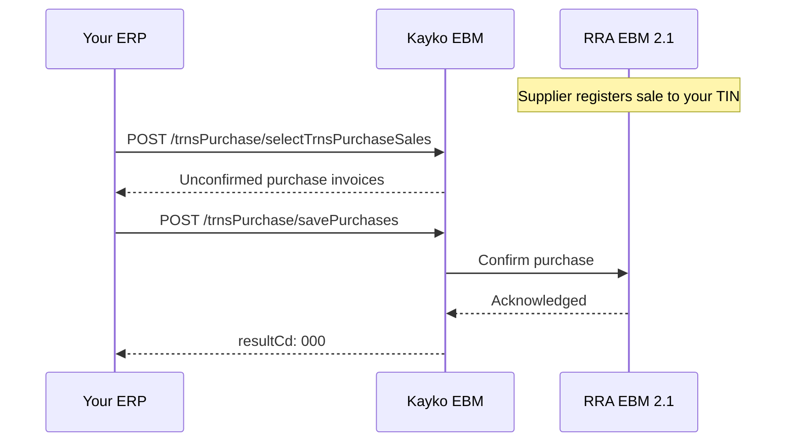

When another business sells to you and registers the sale on EBM, you can **pull** that invoice and **confirm** it as a purchase. This is essential for input VAT claims and stock adjustments.



## Step 1- Pull pending purchases

Retrieve sales that were made **to your TIN** but haven't been confirmed yet.

<CodeGroup>

```bash cURL
curl -X POST "{{baseUrl}}/trnsPurchase/selectTrnsPurchaseSales" \
  -H "Content-Type: application/json" \
  -d '{
    "tin": "999958074",
    "bhfId": "00",
    "lastReqDt": "20240706204443"
  }'
```

```javascript JavaScript
const purchases = await fetch(`${BASE_URL}/trnsPurchase/selectTrnsPurchaseSales`, {
  method: 'POST',
  headers: { 'Content-Type': 'application/json' },
  body: JSON.stringify({
    tin: '999958074',
    bhfId: '00',
    lastReqDt: '20240706204443',
  }),
}).then(r => r.json());

// purchases.data.saleList- array of unconfirmed supplier invoices
```

```php PHP
<?php
$response = ebmPost('/trnsPurchase/selectTrnsPurchaseSales', [
    'tin' => '999958074',
    'bhfId' => '00',
    'lastReqDt' => '20240706204443',
]);

foreach ($response['data']['saleList'] as $sale) {
    echo $sale['spplrNm'] . ' - Invoice #' . $sale['spplrInvcNo'];
}
```

```json Payload
{
  "tin": "999958074",
  "bhfId": "00",
  "lastReqDt": "20240706204443"
}
```

</CodeGroup>

### Response structure

Each item in `saleList` contains the supplier's sale data:

| Field | Description |
|-------|-------------|
| `spplrTin` | Supplier's TIN |
| `spplrNm` | Supplier's name |
| `spplrInvcNo` | Supplier's invoice number |
| `prcOrdCd` | Purchase order code (if provided by supplier) |
| `itemList` | Line items with supplier item codes |

## Step 2- Confirm a purchase

Map the supplier's items to your own `itemCd` and submit the confirmation.

<CodeGroup>

```bash cURL
curl -X POST "{{baseUrl}}/trnsPurchase/savePurchases" \
  -H "Content-Type: application/json" \
  -d @purchase-confirm.json
```

```javascript JavaScript
const confirmation = {
  tin: '999958074',
  bhfId: '00',
  invcNo: 18,
  orgInvcNo: 18,
  spplrTin: '105418285',
  spplrNm: 'SUNDOWNER Ltd',
  spplrInvcNo: '17',
  regTyCd: 'A',
  pchsTyCd: 'N',
  rcptTyCd: 'N',
  pmtTyCd: '01',
  pchsSttsCd: '02',
  cfmDt: '20240706165014',
  pchsDt: '20200303',
  totItemCnt: 2,
  taxblAmtB: 8000,
  taxRtB: 18,
  taxAmtB: 1220.34,
  totTaxblAmt: 8000,
  totTaxAmt: 1220.34,
  totAmt: 8000,
  itemList: [/* mapped items */],
  regrId: '1', regrNm: 'Kayko',
  modrId: '1', modrNm: 'Kayko',
};

await fetch(`${BASE_URL}/trnsPurchase/savePurchases`, {
  method: 'POST',
  headers: { 'Content-Type': 'application/json' },
  body: JSON.stringify(confirmation),
});
```

```php PHP
<?php
// Map supplier items to your itemCd before confirming
$confirmation = [
    'tin' => '999958074',
    'bhfId' => '00',
    'spplrTin' => '105418285',
    'spplrNm' => 'SUNDOWNER Ltd',
    'spplrInvcNo' => '17',
    'regTyCd' => 'A',
    'pchsTyCd' => 'N',
    'pchsSttsCd' => '02',
    'pchsDt' => date('Ymd'),
    // ... tax totals and itemList
];
```

```json Payload
{
  "tin": "999958074",
  "bhfId": "00",
  "invcNo": 18,
  "orgInvcNo": 18,
  "spplrTin": "105418285",
  "spplrNm": "SUNDOWNER Ltd",
  "spplrInvcNo": "17",
  "regTyCd": "A",
  "pchsTyCd": "N",
  "rcptTyCd": "N",
  "pmtTyCd": "01",
  "pchsSttsCd": "02",
  "cfmDt": "20240706165014",
  "pchsDt": "20200303",
  "wrhsDt": "20240706165014",
  "cnclReqDt": null,
  "cnclDt": null,
  "rfdDt": null,
  "totItemCnt": 2,
  "taxblAmtA": 0,
  "taxblAmtB": 8000,
  "taxblAmtC": 0,
  "taxblAmtD": 0,
  "taxRtA": 0,
  "taxRtB": 18,
  "taxRtC": 0,
  "taxRtD": 0,
  "taxAmtA": 0,
  "taxAmtB": 1220.34,
  "taxAmtC": 0,
  "taxAmtD": 0,
  "totTaxblAmt": 8000,
  "totTaxAmt": 1220.34,
  "totAmt": 8000,
  "remark": null,
  "modrId": "1",
  "modrNm": "Kayko",
  "regrId": "1",
  "regrNm": "Kayko",
  "itemList": [
    {
      "itemSeq": 1,
      "itemCd": "RW2BQL0000003",
      "itemClsCd": "4111363900",
      "itemNm": "Water Jibu 2",
      "bcd": null,
      "spplrItemClsCd": "5012161100",
      "spplrItemCd": "RW3NTXNOX0000006",
      "spplrItemNm": "Buffet",
      "pkgUnitCd": "BQ",
      "pkg": 1,
      "qtyUnitCd": "L",
      "qty": 2,
      "prc": 100,
      "splyAmt": 100,
      "dcRt": 0,
      "dcAmt": 0,
      "totDcAmt": 0,
      "taxTyCd": "B",
      "taxblAmt": 7000,
      "taxAmt": "2135.59",
      "totAmt": 7000,
      "itemExprDt": null
    },
    {
      "itemSeq": 2,
      "itemCd": "RW2BQL0000003",
      "itemClsCd": "4111363900",
      "itemNm": "Water Jibu 2",
      "bcd": null,
      "spplrItemClsCd": "5020220100",
      "spplrItemCd": "RW2BCXU0000001",
      "spplrItemNm": "Fanta 33 Cl",
      "pkgUnitCd": "BQ",
      "pkg": 1,
      "qtyUnitCd": "L",
      "qty": 2,
      "prc": 100,
      "splyAmt": 100,
      "dcRt": 0,
      "dcAmt": 0,
      "totDcAmt": 0,
      "taxTyCd": "B",
      "taxblAmt": 1000,
      "taxAmt": "305.08",
      "totAmt": 1000,
      "itemExprDt": null
    }
  ]
}
```

</CodeGroup>

## Item mapping

When confirming, you must map supplier items to your catalog:

| Supplier field | Your field | Notes |
|----------------|------------|-------|
| `spplrItemCd` | `itemCd` | Your registered product code |
| `spplrItemClsCd` | `itemClsCd` | Your classification code |
| `spplrItemNm` | `itemNm` | Can use supplier name or your own |

## Purchase receipt types

| `rcptTyCd` | Meaning |
|------------|---------|
| `P` | Purchase |
| `R` | Refund after purchase |

## Common errors

| Code | Meaning | Fix |
|------|---------|-----|
| `881` | Purchase is mandatory | `prcOrdCd` required for business customers |
| `882` | Purchase code is invalid | Verify the `prcOrdCd` with the supplier |
| `883` | Purchase already used | This purchase was already confirmed |
| `884` | Invalid customer TIN | Check `spplrTin` / `custTin` values |

## See also

- [Purchases API Reference](/api/purchases)
- [Stock Management](/workflows/stock-management)- adjust inventory after confirming
