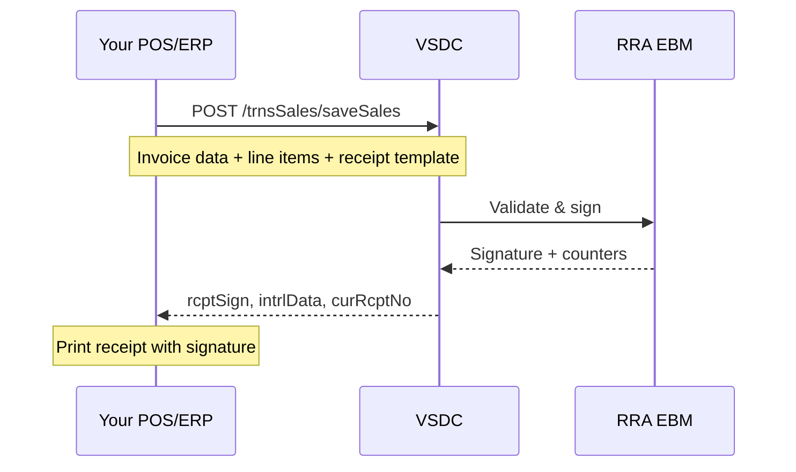

## Overview



## Sale types

All sale types use the same endpoint (`/trnsSales/saveSales`) with different field values:

| Type | `salesTyCd` | `rcptTyCd` | `orgInvcNo` | Notes |
|------|-------------|------------|-------------|-------|
| **Normal sale** | `"N"` | `"S"` | Same as `invcNo` | Standard transaction |
| **Refund** | `"R"` | `"R"` | Original invoice # | Must reference the original sale |
| **Copy** | `"C"` | `"S"` | Original invoice # | Reprint of existing invoice |
| **Training** | `"T"` | `"S"` |- | Practice mode, no legal effect |
| **Proforma** | `"P"` | `"S"` |- | Quote, not a tax document |

## Normal sale- complete example

<CodeGroup>

```bash cURL
curl -X POST "https://vsdc.kayko.rw/rra-2.1.2.3.8/trnsSales/saveSales" \
  -H "Content-Type: application/json" \
  -d '{
    "tin": "100027060",
    "bhfId": "00",
    "invcNo": "1799",
    "orgInvcNo": "1799",
    "cfmDt": "20260303145619",
    "salesDt": "20260303",
    "salesTyCd": "N",
    "rcptTyCd": "S",
    "pmtTyCd": "02",
    "salesSttsCd": "02",
    "prchrAcptcYn": "Y",
    "custNm": "RULIBA CLAYS LTD",
    "custTin": "100004527",
    "totItemCnt": 1,
    "taxRtA": 0, "taxRtB": 18, "taxRtC": 0, "taxRtD": 0,
    "taxblAmtA": 0, "taxblAmtB": 2000, "taxblAmtC": 0, "taxblAmtD": 0,
    "taxAmtA": 0, "taxAmtB": 305.08, "taxAmtC": 0, "taxAmtD": 0,
    "totTaxblAmt": 2000, "totTaxAmt": 305.08, "totAmt": 2000,
    "receipt": {
      "rptNo": "1799",
      "custTin": "100004527",
      "trdeNm": "RULIBACLAYSLTD",
      "topMsg": "SONATUBES Ltd\nADDRESS KIGALI\nTIN 100027060",
      "btmMsg": "Kayko v.2.3.11",
      "prchrAcptcYn": "Y"
    },
    "itemList": [{
      "itemSeq": 1,
      "itemCd": "RW2NTU0000642",
      "itemClsCd": "8014160101",
      "itemNm": "TOLE PL 2 44X1 22X10",
      "taxTyCd": "B",
      "qty": 2,
      "prc": 1000,
      "splyAmt": 2000,
      "taxblAmt": 2000,
      "taxAmt": 305.08,
      "totAmt": 2000,
      "pkg": 1,
      "pkgUnitCd": "NT",
      "qtyUnitCd": "U",
      "dcRt": 0, "dcAmt": 0, "totDcAmt": 0
    }],
    "regrId": "1", "regrNm": "Kayko",
    "modrId": "1", "modrNm": "Kayko"
  }'
```

```javascript JavaScript
const sale = await fetch(`${BASE_URL}/trnsSales/saveSales`, {
  method: 'POST',
  headers: { 'Content-Type': 'application/json' },
  body: JSON.stringify({
    tin: '100027060',
    bhfId: '00',
    invcNo: '1799',
    orgInvcNo: '1799',
    cfmDt: formatDateTime(new Date()),  // yyyyMMddHHmmss
    salesDt: formatDate(new Date()),      // yyyyMMdd
    salesTyCd: 'N',
    rcptTyCd: 'S',
    pmtTyCd: '02',
    salesSttsCd: '02',
    prchrAcptcYn: 'Y',
    custNm: 'RULIBA CLAYS LTD',
    custTin: '100004527',
    totItemCnt: 1,
    taxRtB: 18,
    taxblAmtB: 2000,
    taxAmtB: 305.08,
    totTaxblAmt: 2000,
    totTaxAmt: 305.08,
    totAmt: 2000,
    receipt: {
      rptNo: '1799',
      custTin: '100004527',
      trdeNm: 'RULIBACLAYSLTD',
      topMsg: 'SONATUBES Ltd\nADDRESS KIGALI\nTIN 100027060',
      btmMsg: 'Kayko v.2.3.11',
      prchrAcptcYn: 'Y',
    },
    itemList: [{
      itemSeq: 1,
      itemCd: 'RW2NTU0000642',
      itemClsCd: '8014160101',
      itemNm: 'TOLE PL 2 44X1 22X10',
      taxTyCd: 'B',
      qty: 2,
      prc: 1000,
      splyAmt: 2000,
      taxblAmt: 2000,
      taxAmt: 305.08,
      totAmt: 2000,
      pkg: 1,
      pkgUnitCd: 'NT',
      qtyUnitCd: 'U',
      dcRt: 0, dcAmt: 0, totDcAmt: 0,
    }],
    regrId: '1', regrNm: 'Kayko',
    modrId: '1', modrNm: 'Kayko',
  }),
}).then(r => r.json());

// Use these on your printed receipt:
const { rcptSign, intrlData, curRcptNo, totRcptNo } = sale.data;
```

```php PHP
<?php
$sale = [
    'tin' => '100027060',
    'bhfId' => '00',
    'invcNo' => '1799',
    'orgInvcNo' => '1799',
    'cfmDt' => date('YmdHis'),
    'salesDt' => date('Ymd'),
    'salesTyCd' => 'N',
    'rcptTyCd' => 'S',
    'pmtTyCd' => '02',
    'salesSttsCd' => '02',
    'prchrAcptcYn' => 'Y',
    'custNm' => 'RULIBA CLAYS LTD',
    'custTin' => '100004527',
    'totItemCnt' => 1,
    'taxRtB' => 18,
    'taxblAmtB' => 2000,
    'taxAmtB' => 305.08,
    'totTaxblAmt' => 2000,
    'totTaxAmt' => 305.08,
    'totAmt' => 2000,
    'receipt' => [
        'rptNo' => '1799',
        'custTin' => '100004527',
        'trdeNm' => 'RULIBACLAYSLTD',
        'topMsg' => "SONATUBES Ltd\nADDRESS KIGALI\nTIN 100027060",
        'btmMsg' => 'Kayko v.2.3.11',
        'prchrAcptcYn' => 'Y',
    ],
    'itemList' => [[
        'itemSeq' => 1,
        'itemCd' => 'RW2NTU0000642',
        'itemClsCd' => '8014160101',
        'itemNm' => 'TOLE PL 2 44X1 22X10',
        'taxTyCd' => 'B',
        'qty' => 2,
        'prc' => 1000,
        'splyAmt' => 2000,
        'taxblAmt' => 2000,
        'taxAmt' => 305.08,
        'totAmt' => 2000,
        'pkg' => 1,
        'pkgUnitCd' => 'NT',
        'qtyUnitCd' => 'U',
        'dcRt' => 0, 'dcAmt' => 0, 'totDcAmt' => 0,
    ]],
    'regrId' => '1', 'regrNm' => 'Kayko',
    'modrId' => '1', 'modrNm' => 'Kayko',
];

$response = vsdcPost('/trnsSales/saveSales', $sale);
```

```json Payload
{
  "tin": "100027060",
  "bhfId": "00",
  "invcNo": "1799",
  "orgInvcNo": "1799",
  "cfmDt": "20260303145619",
  "salesDt": "20260303",
  "salesTyCd": "N",
  "rcptTyCd": "S",
  "pmtTyCd": "02",
  "salesSttsCd": "02",
  "prchrAcptcYn": "Y",
  "custNm": "RULIBA CLAYS LTD",
  "custTin": "100004527",
  "totItemCnt": 1,
  "taxRtA": 0,
  "taxRtB": 18,
  "taxRtC": 0,
  "taxRtD": 0,
  "taxblAmtA": 0,
  "taxblAmtB": 2000,
  "taxblAmtC": 0,
  "taxblAmtD": 0,
  "taxAmtA": 0,
  "taxAmtB": 305.08,
  "taxAmtC": 0,
  "taxAmtD": 0,
  "totTaxblAmt": 2000,
  "totTaxAmt": 305.08,
  "totAmt": 2000,
  "receipt": {
    "rptNo": "1799",
    "custTin": "100004527",
    "trdeNm": "RULIBACLAYSLTD",
    "topMsg": "SONATUBES Ltd
ADDRESS KIGALI
TIN 100027060",
    "btmMsg": "Kayko v.2.3.11",
    "prchrAcptcYn": "Y"
  },
  "itemList": [
    {
      "itemSeq": 1,
      "itemCd": "RW2NTU0000642",
      "itemClsCd": "8014160101",
      "itemNm": "TOLE PL 2 44X1 22X10",
      "taxTyCd": "B",
      "qty": 2,
      "prc": 1000,
      "splyAmt": 2000,
      "taxblAmt": 2000,
      "taxAmt": 305.08,
      "totAmt": 2000,
      "pkg": 1,
      "pkgUnitCd": "NT",
      "qtyUnitCd": "U",
      "dcRt": 0,
      "dcAmt": 0,
      "totDcAmt": 0
    }
  ],
  "regrId": "1",
  "regrNm": "Kayko",
  "modrId": "1",
  "modrNm": "Kayko"
}
```

</CodeGroup>

### Success response

```json
{
  "resultCd": "000",
  "resultMsg": "It is succeeded",
  "resultDt": "20260303145619",
  "data": {
    "rcptNo": 1799,
    "intrlData": "CUJHWLCUETLWZXS2YR4WKD7WEM",
    "rcptSign": "KYSNC4HM6YROYNI2",
    "totRcptNo": 1321,
    "vsdcRcptPbctDate": "20260303145619",
    "sdcId": "SDC010000005",
    "mrcNo": "WIS01006230"
  }
}
```

Print `rcptSign` and `intrlData` on the receipt- they're required for EBM compliance.

## Refund workflow

Refunds use the same endpoint with different codes:

| Field | Normal Sale | Refund |
|-------|-------------|--------|
| `salesTyCd` | `"N"` | `"R"` |
| `rcptTyCd` | `"S"` | `"R"` |
| `orgInvcNo` | Same as `invcNo` | **Original sale's** `invcNo` |
| `invcNo` | New sequential # | New sequential # |
| `rfdRsnCd` | `null` | Required- see [Refund Reasons](/reference/enumerations#refund-reason-code) |

## Resend a failed sale

If a sale was processed locally but didn't reach RRA, use the resend endpoint with the **full original payload** including the receipt signature:

`POST /trnsSales/resendSales`

The payload is identical to `saveSales` but must include `rcptSign`, `intrlData`, `curRcptNo`, and `totRcptNo` from the original attempt.

## Business rules

<AccordionGroup>
  <Accordion title="prcOrdCd- Purchase Order Code (v1.0.5+)">
    Mandatory when the customer is a **registered business** (has a TIN). Optional for individual/walk-in customers. Missing this for business customers returns error `881`.
  </Accordion>
  <Accordion title="regrNm / modrNm- max 8 characters">
    The registrant and modifier names must not exceed 8 characters on sales transactions.
  </Accordion>
  <Accordion title="Invoice numbers must be sequential">
    `invcNo` must increment. Use the `lastSaleInvcNo` from initialization to know where to start.
  </Accordion>
  <Accordion title="Customer TIN validation">
    Invalid customer TINs return error `884`. Use `/customers/selectCustomer` to verify before selling.
  </Accordion>
</AccordionGroup>

## See also

- [Sales API Reference](/api/sales)- full field tables
- [Calculations](/calculations/overview)- how to compute amounts
- [Response Codes](/reference/response-codes)- error handling
