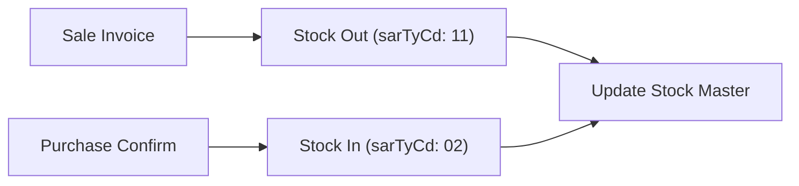

Stock management in VSDC tracks inventory movements (in/out) and maintains a stock master (current quantities). Every stock operation must follow a sale or purchase.



## Step 1- Record stock in/out

`POST /stock/saveStockItems`

<CodeGroup>

```bash cURL
curl -X POST "{{baseUrl}}/stock/saveStockItems" \
  -H "Content-Type: application/json" \
  -d '{
    "tin": "999958074",
    "bhfId": "00",
    "sarNo": "106",
    "orgSarNo": "00",
    "regTyCd": "M",
    "sarTyCd": "11",
    "ocrnDt": "20240520",
    "totItemCnt": 1,
    "totTaxblAmt": 1000,
    "totTaxAmt": 152.54,
    "totAmt": 1000,
    "itemList": [{
      "itemSeq": 1,
      "itemCd": "RW3NTXNOX0000006",
      "itemClsCd": "5012161100",
      "itemNm": "Inyange Water",
      "qty": 50,
      "prc": 10000,
      "splyAmt": 1000,
      "taxTyCd": "B",
      "taxblAmt": 1000,
      "taxAmt": 152.54,
      "totAmt": 1000,
      "pkg": 1,
      "pkgUnitCd": "NT",
      "qtyUnitCd": "U"
    }],
    "regrId": "1", "regrNm": "Kayko",
    "modrId": "1", "modrNm": "Kayko"
  }'
```

```javascript JavaScript
await fetch(`${BASE_URL}/stock/saveStockItems`, {
  method: 'POST',
  headers: { 'Content-Type': 'application/json' },
  body: JSON.stringify({
    tin: '999958074',
    bhfId: '00',
    sarNo: '106',
    orgSarNo: '00',
    regTyCd: 'M',
    sarTyCd: '11', // 11 = Outgoing Sale
    ocrnDt: '20240520',
    totItemCnt: 1,
    totTaxblAmt: 1000,
    totTaxAmt: 152.54,
    totAmt: 1000,
    itemList: [{ /* ... */ }],
    regrId: '1', regrNm: 'Kayko',
    modrId: '1', modrNm: 'Kayko',
  }),
});
```

```php PHP
<?php
$response = vsdcPost('/stock/saveStockItems', [
    'tin' => '999958074',
    'bhfId' => '00',
    'sarNo' => '106',
    'sarTyCd' => '11',
    'ocrnDt' => date('Ymd'),
    'itemList' => [/* ... */],
    // ...
]);
```

```json Payload
{
  "tin": "999958074",
  "regTyCd": "M",
  "useYn": "Y",
  "bhfId": "00",
  "remark": null,
  "modrId": "1",
  "modrNm": "Kayko",
  "regrId": "1",
  "regrNm": "Kayko",
  "sarTyCd": "11",
  "sarNo": "106",
  "orgSarNo": "00",
  "custTin": null,
  "custNm": null,
  "custBhfId": null,
  "ocrnDt": "20240520",
  "totItemCnt": 1,
  "totTaxblAmt": 1000,
  "totTaxAmt": 1000,
  "totAmt": 1000,
  "itemList": [
    {
      "itemSeq": 1,
      "itemCd": "RW3NTXNOX0000006",
      "itemClsCd": "5012161100",
      "itemNm": "Inyange Water",
      "qtyUnitCd": "U",
      "pkgUnitCd": "NT",
      "bcd": null,
      "qty": 50,
      "prc": 10000,
      "splyAmt": 1000,
      "totDcAmt": 9000,
      "taxTyCd": "B",
      "taxblAmt": 1000,
      "taxAmt": 152.54,
      "totAmt": 1000,
      "pkg": 1,
      "itemExprDt": "20250101"
    }
  ]
}
```

</CodeGroup>

### Stock movement types (`sarTyCd`)

| Code | Direction | Meaning |
|------|-----------|---------|
| `01` | In | Import |
| `02` | In | Purchase |
| `03` | In | Return |
| `04` | In | Stock movement (transfer in) |
| `06` | In | Adjustment (in) |
| `11` | Out | Sale |
| `12` | Out | Return |
| `13` | Out | Stock movement (transfer out) |
| `15` | Out | Discarding |
| `16` | Out | Adjustment (out) |

## Step 2- Update stock master

After stock in/out, update the remaining quantity:

`POST /stockMaster/saveStockMaster`

```json
{
  "tin": "999958074",
  "bhfId": "00",
  "itemCd": "RW1NTXU0000006",
  "rsdQty": 150,
  "regrId": "123",
  "regrNm": "Kayko",
  "modrId": "123",
  "modrNm": "Kayko"
}
```

## Step 3- Query stock history (optional)

Pull past stock movements for reconciliation:

`POST /stock/selectStockItems`

```json
{
  "tin": "999958074",
  "bhfId": "00",
  "lastReqDt": "20210520000000"
}
```

## Ordering constraints

<Warning>
  Stock operations have strict prerequisites:
</Warning>

1. **Stock out** requires the related **sale invoice** to be submitted first
2. **Stock master update** requires the related **stock in/out** to be submitted first
3. `sarNo` must be unique and sequential per branch

## See also

- [Stock API Reference](/api/stock)
- [Sales Workflow](/workflows/sales-invoice)
- [Stock In/Out Types](/reference/enumerations#stock-inout-type)
